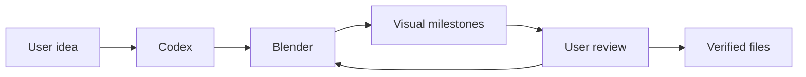

# Codex Blender Plugin


> Let Codex create, review, save, and export Blender designs through a guarded local Harness.

[English](README.md) | [简体中文](README.zh-CN.md)

## What it does

`codex-blender` turns an idea into a Blender scene through structured modeling, materials,
lighting, camera, animation, milestone previews, checkpoints, and verified exports.



## Two modes

- **Managed:** Codex launches Blender and temporarily loads the Harness. No Blender Add-on is installed.
- **Connector:** an optional lightweight Add-on attaches Codex to a Blender window already open.

Both modes use the same authenticated local protocol, command registry, revision checks, and
artifact receipts. Managed mode is the default.

## Current commands

- Scene inspection
- Primitive mesh creation and transforms
- Rename, parent, delete, and modifiers
- PBR materials and assignment
- Cameras, lights, frame range, and keyframes
- Camera/front/side/top milestone renders
- BLEND, GLB, GLTF, FBX, OBJ, STL, PNG, JPG, and MP4 export routes

## Safety

- Closed command allowlist; no arbitrary Python by default
- Main-thread Blender mutation
- Scene revision and request idempotency
- Action-bound authorization for destructive actions and exports
- Private UDS/Named Pipe transport with tokenized loopback fallback
- Transaction snapshots and rollback evidence

## Install

[Download Blender](https://www.blender.org/download/), then install from the GitHub marketplace:

```bash
codex plugin marketplace add https://github.com/partme-ai/codex-blender-plugin.git --ref main
codex plugin add codex-blender@partme-ai-blender
```

See [the Chinese getting-started guide](docs/getting-started.zh-CN.md).

## Product boundary

This plugin stops at verified local Blender files. Downstream AI rendering, account login,
pricing, submission, polling, and paid actions belong to their own orchestration plugins.

## Development

```bash
python3 -m unittest discover -s tests -v
python3 scripts/validate_distribution.py
python3 scripts/package_connector.py dist/codex-blender-connector.zip
```

Architecture and execution truth live in:

- [Harness design](docs/superpowers/specs/2026-09-12-codex-blender-harness-design.md)
- [Implementation plan](docs/superpowers/plans/2026-09-12-codex-blender-harness-implementation.md)
- [Runtime verification](docs/verification/harness-runtime.md)

## License

Apache-2.0. See [LICENSE](LICENSE).
