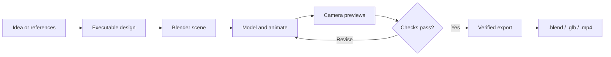
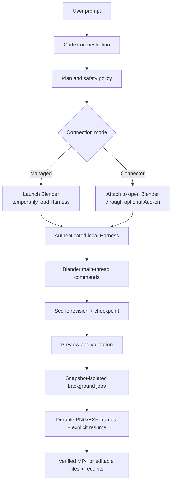

# Codex Blender Plugin

<p align="center">
  
</p>

<p align="center">
  <strong>Describe the scene. Watch Blender build it. Keep the source files.</strong><br>
  A guarded local Harness for modeling, animation, camera work, visual review, recovery, and verified export.
</p>

<p align="center">
  <a href="README.md">English</a> ·
  <a href="README.zh-CN.md">简体中文</a> ·
  <a href="docs/getting-started.zh-CN.md">Getting started</a> ·
  <a href="docs/verification/harness-runtime.md">Runtime evidence</a>
</p>

## From one prompt to editable Blender deliverables

Give Codex an idea, reference assets, or an action timeline. The plugin turns it into structured Blender work instead of a disposable image: scene objects, materials, lights, cameras, animation, checkpoints, previews, and export receipts.



If referenced assets are missing, Codex asks for them by default. When you explicitly authorize original proxy design, it can build and label Blender stand-ins for missing characters, props, environments, or motion references.

## Case study: an 8-second spear fight

The same production loop used for the repository's end-to-end test is included here as a concrete example:

1. A written action timeline defined two characters, one spear, five action beats, an 8-second duration, and a low handheld camera route.
2. Codex built the editable Blender white model, animated the attack and reaction sequence, and validated framing, keyframes, duration, and the single-prop constraint.
3. Blender exported the `.blend` source and a playable H.264 white-model preview.
4. After an explicit cross-plugin handoff, the validated preview was used as the motion reference for a separate downstream result.

<table>
  <tr>
    <th>Editable Blender white model</th>
    <th>Optional downstream result</th>
  </tr>
  <tr>
    <td></td>
    <td></td>
  </tr>
</table>

<p align="center">
  <a href="assets/showcase/spear-fight-white-model-preview.mp4"><strong>▶ Watch the 8-second white-model preview</strong></a>
  &nbsp;&nbsp;·&nbsp;&nbsp;
  <a href="assets/showcase/spear-fight-final-preview.mp4"><strong>▶ Watch the 8-second downstream result</strong></a>
</p>

The repository contains lightweight 640×360 promotional previews so the README stays fast. `codex-blender` owns the left-hand deliverable: the editable Blender scene and verified local exports. The right-hand video is a separate downstream example produced only after an explicit handoff to `codex-dreamina-3d`. Cloud login, pricing, submission, polling, and paid actions stay outside this plugin.

## Install in two commands

1. [Download and install Blender](https://www.blender.org/download/). Launch it once and confirm that the default cube appears.
2. Install the plugin from its GitHub marketplace:

```bash
codex plugin marketplace add https://github.com/partme-ai/codex-blender-plugin.git --ref main
codex plugin add codex-blender@partme-ai-blender
```

Open a new Codex task and try:

```text
Use managed mode to start Blender. Create a matte-orange desktop speaker with a rounded body,
a black front grille, and one control knob. Show camera, front, side, and top previews.
When validation passes, export a new .blend, .glb, and .png into my output folder.
```

For screenshots, Connector installation, missing-asset policy, automatic execution, and export receipts, follow the [step-by-step guide](docs/getting-started.zh-CN.md).

## Two ways to connect

| Mode | Blender Add-on | Best for |
|---|---:|---|
| **Managed — default** | Not required | Starting a fresh task with a non-invasive temporary Harness |
| **Connector** | Optional lightweight Add-on | Continuing work in an already-open Blender window |

Both modes use the same authenticated local protocol, closed command registry, scene revisions, transactions, and artifact receipts.



The hybrid baseline keeps Blender visible and interactive for design work while long exports run safely against committed snapshots in the background. Pause/take over lets an artist edit directly; resume forces a fresh scene inspection before Codex continues.

## What you can build

- Scene assembly, collections, stable object identity, transforms, BMesh, curves, modifiers, and approved asset imports
- Hard-surface and procedural recipes, UVs, PBR materials, Geometry Nodes, sculpting, Hair Curves, and texture baking
- Armatures, weights, IK/FK, constraints, Actions, F-Curves, NLA, shape keys, retargeting, and prop handoff
- Camera paths, handheld response, lighting, Eevee/Cycles, compositor graphs, passes, and EXR delivery
- Rigid body, cloth, soft body, smoke, isolated cache baking, Grease Pencil, tracking, and editable VSE Scene/image-sequence/text/sound timelines
- Persistent PNG or multilayer EXR sequences with per-frame hashes, explicit missing-frame resume, and separate FFmpeg composition
- Snapshot-isolated background jobs with status, cancellation, non-restarting recovery, and explicitly requested frame resume

Running-session truth comes from `capability.list` and `capability.describe`. The catalog is counted **per runtime mode** and generated from the registry, never hand-maintained — the numbers below are reproduced by `docs/verification/capability-counts.json`.

- **Managed** records 189 commands: 172 at L3, 3 Windows-verified recovery/Rigify commands at L4, 14 at L1, across 35 domains, routed through 23 Skills.
- **Connector** adds the 5 optional `official_uploader.*` commands: 191 commands, 169 at L3, 3 at L4, 19 at L1, across 36 domains, routed through 24 Skills.

The two modes are never merged into a single count. Tool, Skill, and platform coverage are measured separately; no combined “100%” is claimed. Foreground Windows UI takeover is not L4-verified. See the [runtime verification](docs/verification/harness-runtime.md).

## Guardrails are part of the product

- Closed structured-command allowlist; arbitrary Python is disabled by default
- Blender data mutates only on the main thread
- Scene revisions prevent stale writes; request IDs prevent duplicate execution
- Deletion, overwrite, expert Python, extended formats, and external actions require action-bound authorization
- Private UDS on macOS and Named Pipe on Windows, with tokenized loopback fallback
- Milestone snapshots, rollback evidence, media probes, hashes, and reimport checks where applicable

## Delivery routes

- `preview_only` — create and validate a local Blender preview.
- `jimeng_web` — delegate once to a user-enabled official uploader in the foreground Connector, then stop at `JimengLinkReady`.
- `downstream_seedance` — hand a validated receipt to `codex-dreamina-3d` for a separately authorized generation flow.

The official uploader is not bundled or installed by this repository. On the current macOS verification host it is not enabled, so the Jimeng Web runtime gate is recorded as blocked even though its command and Skill contracts pass offline.

## Develop and verify

```bash
python3 -m unittest discover -s tests -v
python3 scripts/validate_distribution.py
python3 scripts/package_connector.py dist/codex-blender-connector.zip
```

- [Harness design](docs/superpowers/specs/2026-09-12-codex-blender-harness-design.md)
- [Implementation plan](docs/superpowers/plans/2026-09-12-codex-blender-harness-implementation.md)
- [Runtime verification](docs/verification/harness-runtime.md)

## License

Apache-2.0. See [LICENSE](LICENSE).
