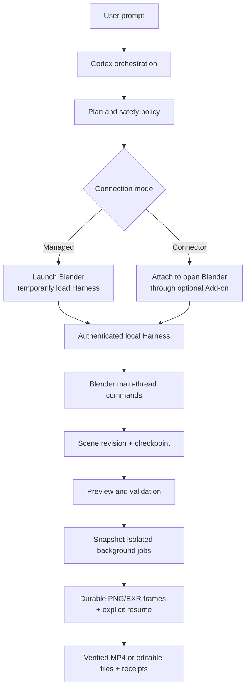

# Blender Design Plugin

<p align="center">
  
</p>

<p align="center">
  <strong>Describe the scene. Watch Blender build it. Keep the source files.</strong><br>
  A guarded local Harness for modeling, animation, camera work, visual review, recovery, and verified export.
</p>

<p align="center">
  <a href="README.md">English</a> ·
  <a href="README.zh-CN.md">简体中文</a> ·
  <a href="docs/getting-started.zh-CN.md">Getting started</a> ·
  <a href="docs/verification/harness-runtime.md">Runtime evidence</a>
</p>

## Positioning

`blender-design` lets Codex drive a real Blender session through a guarded local Harness. Instead of returning a disposable image, it builds editable scene objects, materials, lights, cameras, animation, checkpoints, previews, and export receipts that you keep.

The Harness is a closed, structured-command surface: arbitrary Python is disabled by default, Blender data mutates only on the main thread, and every irreversible action needs an action-bound authorization token.

### Who it is for

- 3D artists and technical artists who want Codex to prepare scenes without losing editability.
- Pipeline engineers who need a scriptable, auditable Blender automation surface.
- Reviewers who need milestone previews and export receipts rather than a claim of success.

### What problem it solves

| Problem | What this plugin provides | Verifiable entry point |
| --- | --- | --- |
| Automation scripts break scenes | Main-thread-only mutation, scene revisions, request IDs | `scripts/harness/server.py`, `docs/Codex-Blender-Plugin-Architecture.md` |
| A failed step ruins the file | Milestone checkpoints and rollback evidence | `scripts/harness/snapshot.py` |
| Long exports block the session | Snapshot-isolated background jobs with explicit resume | `docs/verification/harness-runtime.md` |
| "It worked" cannot be verified | Media probes, hashes, reimport checks, receipts | `scripts/harness/exporter.py` |
| Missing assets stall a task | Ask-first policy, or labelled proxy design on explicit authorization | `docs/getting-started.zh-CN.md` |

## At a glance

```text
Idea / references / action timeline
      │
      ▼
┌──────────────────────────────────────────────────────────┐
│ blender-design                                            │
│  ① plan     executable design + safety policy            │
│  ② connect  managed launch, or Connector Add-on          │
│  ③ build    structured commands on the Blender main thread│
│  ④ review   milestone previews and checkpoints           │
│  ⑤ export   verified .blend / .glb / .png / .mp4 + receipt│
└──────────────────────────────────────────────────────────┘
      │
      ▼
Editable Blender scene + verified local exports
```

| Property | Value |
| --- | --- |
| Plugin ID | `blender-design` |
| Host | Codex CLI or ChatGPT desktop app |
| Current version | `0.14.1` |
| Plugin manifest | `.codex-plugin/plugin.json` |
| MCP configuration | `.mcp.json` bootstraps the SHA-pinned PartMe Blender MCP `v0.7.0-rc.2` and official MCP SDK in an isolated user venv; no second MCP implementation |
| Primary language | Python 3.13 Harness + Blender Add-on |
| License | Apache-2.0 |

## Capabilities and boundaries

### Supported

| Capability | Input | Output | Limit | Status |
| --- | --- | --- | --- | --- |
| Scene assembly | Idea, references, or timeline | Collections, stable object identity, transforms, BMesh, curves, modifiers | Approved asset imports only | Stable |
| Modeling and surfacing | Design intent | Hard-surface and procedural recipes, UVs, PBR materials, Geometry Nodes, sculpt, Hair Curves, baking | — | Stable |
| Rigging and animation | Character or prop intent | Armatures, weights, IK/FK, constraints, Actions, F-Curves, NLA, shape keys, retargeting | — | Stable |
| Cinematography | Shot intent | Camera paths, handheld response, lighting, Eevee/Cycles, compositor graphs, passes, EXR delivery | — | Stable |
| Simulation and sequence | Scene intent | Rigid body, cloth, soft body, smoke, cache baking, Grease Pencil, tracking, VSE timelines | — | Stable |
| Background jobs | Long export or bake | PNG or multilayer EXR sequences with per-frame hashes, explicit missing-frame resume | Isolated from the live scene snapshot | Stable |
| Export | Approved scene | `.blend`, `.glb`, `.png`, H.264 `.mp4` plus receipts | FFmpeg and ffprobe required for video | Stable |

### Two connection modes

| Mode | Blender Add-on | Best for |
| --- | ---: | --- |
| **Managed — default** | Not required | Starting a fresh task with a non-invasive temporary Harness |
| **Connector** | Optional lightweight Add-on | Continuing work in an already-open Blender window |

Running-session truth comes from `capability.list` and `capability.describe`. The catalog is counted **per runtime mode**, generated from the command registry, and reproduced by `docs/verification/capability-counts.json`.

- **Managed** registers 196 commands: 175 at L3, 3 Windows-verified recovery and Rigify commands at L4, 18 at L1, and 0 at L2, across 35 domains, routed through 23 of the 37 bundled Skills.
- **Connector** adds the 5 optional `official_uploader.*` commands: 201 commands, 175 at L3, 3 at L4, 23 at L1, and 0 at L2, across 36 domains, routed through 24 Skills.

The two modes are never merged into a single count, and no combined coverage percentage is claimed. Foreground Windows UI takeover is not L4-verified. See the [runtime evidence](docs/verification/harness-runtime.md).

### Not responsible for

- Cloud login, pricing, submission, polling, and paid actions. Those stay outside this plugin.
- Bundling or installing the official jimeng uploader. It is user-enabled and, on the current macOS verification host, absent — so the Jimeng Web runtime gate is recorded as blocked even though its command and Skill contracts pass offline.
- Autodesk Maya. Maya is out of scope for this plugin.
- Foreground Windows UI takeover. Windows Server 2025 x64 / Blender 5.2.1 background recovery, Rigify, Named Pipe, and packaging passed the current L4 workflow; an interactive Windows desktop session remains unverified.

### Maturity

| Status | Meaning |
| --- | --- |
| Stable | Automated tests plus runtime evidence; usable for real work |
| Experimental | Behaviour may change; pin the version and verify before relying on it |
| Blocked / NOT_RUN | Not verified on this host; never present it as working |

### Bundled orchestration skills

| Skill | What it wraps | Tier-aware? |
| --- | --- | --- |
| `blender-design` | Milestone-based scene build from an idea | No — single-mode orchestrator |
| `blender-design-loop` | Closed dream → build → screenshot → critique → iterate loop against a target image; uses `scene.screenshot` + `blender-harness` JSON commands | Yes — Plus (low-quota, 3-round cap) vs Pro (judge subagent per round) |

Both skills are plugin-local (live under `./skills/`). They share
the `blender-harness` execution surface; neither duplicates it.

## Architecture and core flow



### Component responsibilities

| Component | Owns | Does not own |
| --- | --- | --- |
| `scripts/launch_harness.py`, `scripts/managed_launcher.py` | Launching Blender and writing the session descriptor | Scene semantics |
| `scripts/harness/server.py` | Transport, session, command dispatch, checkpoints | Domain modelling |
| `scripts/harness/execution_policy.py` | Which actions are irreversible and need authorization | User intent interpretation |
| `scripts/harness/authorization.py` | Ephemeral HMAC tokens, TTL, action binding | Long-lived credentials |
| `scripts/harness/exporter.py` | Verified export and media probing | Artistic decisions |
| `vendor/partme-blender-mcp-addon-0.7.0-rc.2.zip` | PartMe Add-on lifecycle for an open session | Codex-specific production workflow |
| `vendor/partme-blender-mcp-runtime-0.7.0-rc.2.zip` | Generic MCP protocol and official-SDK tool exposure | Codex-specific Skills |
| `skills/` (34) | Routing and domain instructions for Codex | Runtime enforcement |

## Compatibility

| Plugin version | Host | Blender | Platform | Status |
| --- | --- | --- | --- | --- |
| `0.13.2` + runtime `0.7.0-rc.2` | Codex CLI or ChatGPT desktop app | Blender 4.2.23 CI baseline; visible Blender 5.2.1 UI acceptance | macOS Apple Silicon (UDS transport) | PASS |
| `0.13.2` + runtime `0.7.0-rc.2` | Codex CLI or ChatGPT desktop app | Blender 5.2.1 background L4 workflow | Windows Server 2025 x64 (Named Pipe transport) | PASS; foreground UI takeover not claimed |
| `0.13.2` + runtime `0.7.0-rc.2` | Codex CLI or ChatGPT desktop app | same | Linux headless (tokenized loopback TCP) | Experimental, not a release gate |

- **Managed** records 192 commands: 175 at L3, 3 Windows-verified recovery/Rigify commands at L4, 14 at L1, across 35 domains, routed through 23 Skills.
- **Connector** adds the 5 optional `official_uploader.*` commands: 201 commands, 175 at L3, 3 at L4, 23 at L1, and 0 at L2, across 36 domains, routed through 24 Skills.
Foreground Windows UI takeover is not L4-verified. Only the combinations in `docs/verification/harness-runtime.md` are claimed.

## Installation

### 1. Install Blender first

Download and install Blender from <https://www.blender.org/download/>, launch it once, and confirm the default cube appears. For video export, install FFmpeg and ffprobe and make sure both are on `PATH`.

> **No Blender yet? [Download the installer](https://www.blender.org/download/)**
>
> Open Blender, enable the MCP Add-on in **Preferences > Add-ons**, then press `N` and click
> **Start MCP Server**.

The trusted and only required Add-on is **PartMe Blender MCP** from the pinned upstream Release.
See the [illustrated first-use guide](docs/getting-started.md). Its integrated provider layer covers
the supported community asset/model services; do not install the separate **MCP for Blender**
Add-on alongside it.

### 2. Install the plugin

```bash
codex plugin marketplace add partme-ai/full-aigc-plugins
codex plugin add blender-design@partme-ai-blender
```

### 3. Connect an open Blender window (one-time setup)

The PartMe Blender MCP server is bundled with this Codex/ZCode/Kimi plugin. **Do not pip-install a
`partme-blender-mcp-*.tar.gz` bundle, and do not paste pip's `Processing ...` output back into the
shell.**

To attach to an open Blender window, install the bundled PartMe Add-on once. Ask Codex to “prepare
the Blender MCP installer”, or use this expert command:

```bash
python3 scripts/package_connector.py dist/partme-blender-mcp-addon-0.7.0-rc.2.zip
```

In Blender choose **Edit → Preferences → Add-ons → Install from Disk**, select that ZIP, enable
**PartMe Blender MCP**, then press `N` in the 3D View and click **Start MCP Server** in the
**PartMe MCP** panel. This is the only one-time manual Blender-side step.

### Confirm it loaded

```bash
codex plugin list
```

Expected entry:

```text
blender-design@partme-ai-blender  installed, enabled
```

Then ask Codex to start managed mode and list capabilities. Running-session truth comes from the Harness itself:

```text
capability.list
capability.describe
```

The catalog is generated from the command registry, never hand-maintained, and counts are reproduced by `docs/verification/capability-counts.json`.

### Installing on ZCode

The same repository carries a ZCode adapter (`.zcode-plugin/plugin.json`, plugin id `blender`).

Local marketplace (fastest):

1. Create a marketplace folder with a `marketplace.json` pointing at this repository:

   ```json
   {
     "name": "partme-ai",
     "plugins": [
       {
         "name": "blender",
         "source": { "source": "directory", "path": "/absolute/path/to/partme-blender-plugin" },
         "category": "Creativity"
       }
     ]
   }
   ```

2. ZCode → 设置 → 插件 → 创建 → 添加插件市场，填该 marketplace 文件夹路径。
3. 在「个人」分段安装 `blender`，新开会话。
4. The MCP bootstrap is zero-configuration: it discovers the active Blender session descriptor and `ffprobe` automatically. Advanced overrides remain available through the runtime environment when needed, but are not unresolved ZCode install-time variables.

Expected after install: `/blender` command group (9 slash commands), 33 skills, `plugin:blender:partme_blender` MCP server, and a SessionStart environment check.

### Installing on Kimi Code CLI

The same repository carries a Kimi adapter (`kimi.plugin.json`, plugin id `blender`). Kimi Code CLI
0.43.1 does not expose a plugin-manager command. Install the tagged repository in a stable local
directory, add its `skills/` directory to `extra_skill_dirs` in `~/.kimi-code/config.toml`, and merge
this server into the existing `mcpServers` object in `~/.kimi-code/mcp.json` without replacing other
servers:

```json
"partme_blender": {
  "command": "python3",
  "args": ["/absolute/path/to/blender-design-plugin/scripts/mcp_bootstrap.py"]
}
```

Run `kimi doctor`, then start a new session. Older Kimi builds that provide a supported plugin
manager may install `kimi.plugin.json` directly; follow the capabilities reported by the installed
client rather than assuming `/plugins` exists.

Expected after install: 33 skills (`/skill:blender-use` as the router), `blender:*` slash
commands, the `partme_blender` MCP server, and bundled hooks (SessionStart / UserPromptSubmit /
Stop).

### Hook trust note (Codex first enable)

The bundled `hooks/hooks.json` is a non-managed hook set. On first enable, Codex asks you to
review and trust it; the hooks are advisory-only (environment check, intent routing hint,
closeout reminder), always exit 0, and never block a turn.

### Install from the complete PartMe catalog

The supported catalog entry is the `partme-ai/full-aigc-plugins` marketplace:

```bash
codex plugin marketplace add partme-ai/full-aigc-plugins
codex plugin add blender-design@partme-ai-blender
```

Notes:

- The plugin repository remains `full-aigc-plugins/blender-design-plugin`; the
  marketplace repository is `partme-ai/full-aigc-plugins`. They have different roles.
- For ZCode or Kimi, follow the manifests published by that marketplace instead of
  reusing a stale standalone-plugin URL.

## Quick start

### 1. Prerequisites

- Blender installed and launchable on this machine.
- FFmpeg and ffprobe on `PATH` when you need MP4 export.
- Python 3.13 available to the Harness (CI baseline).
- Enough disk space for checkpoint snapshots and frame sequences.

### 2. Start a managed session

Open a new Codex task and ask for a scene. A minimal prompt that exercises modeling, previews, and export:

```text
Use managed mode to start Blender. Create a matte-orange desktop speaker with a rounded body,
a black front grille, and one control knob. Show camera, front, side, and top previews.
When validation passes, export a new .blend, .glb, and .png into my output folder.
```

Expected observation: Blender launches, the Harness loads temporarily, milestone previews appear, and the export step reports a receipt with file hashes.

### 3. Continue in an open Blender window

Install the Connector Add-on, open your project, and ask Codex to attach. Pause and take over lets you edit directly; resuming forces a fresh scene inspection before Codex continues, so your manual edits are never overwritten by stale state.

## Configuration

### Environment variables

| Variable | Purpose | Default |
| --- | --- | --- |
| `CODEX_BLENDER_DESCRIPTOR` | Path to the Harness session descriptor | Written by the launcher |
| `CODEX_BLENDER_RUNTIME_DIR` | Override the runtime directory | Harness default |
| `CODEX_BLENDER_FFMPEG` | Override the FFmpeg binary | `ffmpeg` on `PATH` |
| `CODEX_BLENDER_FFPROBE` | Override the ffprobe binary | `ffprobe` on `PATH` |

### Configuration files

| File | Purpose |
| --- | --- |
| `config/blender-release-matrix.json` | Which Blender versions are supported |
| `config/production-profile.json` | Domains and command classes excluded from the production catalog |

There are no API keys. Session authorization uses ephemeral HMAC tokens generated at session start with a 60-second default TTL, bound to a specific action.

## Harness contract

### Session lifecycle

| Phase | Input | Must complete | Failure semantics |
| --- | --- | --- | --- |
| `launch` | Blender path, runtime dir | Start Blender, load the Harness | Launch fails; no half-loaded session |
| `handshake` | Session descriptor | Authenticate and register capabilities | Session marked unavailable |
| `execute` | Structured command | Mutate on the main thread, bump scene revision | Returns a stable error code |
| `pause / takeover` | User action | Release control to the artist | Harness stays attached |
| `resume` | Continue request | Re-inspect the scene before mutating | Stale state is never applied |
| `shutdown` | Stop request | Flush checkpoints, close transport | Safe termination after timeout |

### Stable error codes

| Code | Meaning | Retryable |
| --- | --- | --- |
| `UNKNOWN_COMMAND` | Command is not in the registry | No |
| `INVALID_ARGUMENT` | Argument failed validation | No |
| `INVALID_COMMAND_DEFINITION` | Registry entry is malformed | No |
| `DUPLICATE_COMMAND` | Command name registered twice | No |
| `INVALID_COMMAND_RESULT` | Handler returned an invalid result | No |
| `UNKNOWN_CAPABILITY` | Capability not advertised by this session | No |
| `SESSION_REVOKED` | Authorization token rejected or expired | Re-authorize |
| `SESSION_CONTROL_CHANGED` | Another actor holds control | Resume with a fresh inspection |

Irreversible actions require action-bound authorization: `delete`, `overwrite`, `expert_python`, `path_escape`, `budget_exceeded`, and `recovery_resubmit`.

## Retry, idempotency, and recovery

- Request IDs prevent duplicate execution; scene revisions prevent stale writes.
- Milestone snapshots provide rollback evidence, and the transaction journal at `<runtime_dir>/recovery.json` drives non-restarting recovery.
- Background jobs are snapshot-isolated: they run against a committed scene state, expose status and cancellation, and never restart work on their own.
- Per-frame hashes make a missing frame detectable, so resume re-renders only what is missing.
- Authorization tokens are single-purpose and time-limited; an expired token fails closed rather than replaying an action.

## Data and state

| Data | Location | Lifecycle | Secrets |
| --- | --- | --- | --- |
| Session descriptor | `<runtime_dir>/<session_id>.json` | Session scope; removed on clean shutdown | Ephemeral HMAC token only |
| Transaction journal | `<runtime_dir>/recovery.json` | Until the session completes or is discarded | None |
| Scene checkpoints | Runtime directory snapshot store | Until you delete them | None |
| Render outputs | Your chosen export directory | Until you delete them | None |
| Project sources | Your `.blend` and asset files | Never silently overwritten | None |

## Security

- Closed structured-command allowlist; arbitrary Python execution is disabled by default and requires explicit `expert_python` authorization.
- Blender data mutates only on the main thread, which prevents the class of corruption that background-thread writes cause.
- Transports are a private Unix domain socket on macOS, a Named Pipe on Windows, and tokenized loopback TCP only as a fallback.
- Authorization claims are HMAC-signed, TTL-limited, and bound to one action.
- Deletion, overwriting, format extension, and external actions all require action-bound authorization.
- The plugin bundles no credentials, and no credential is written to disk by the Harness.

## Development and verification

```bash
python3 -m unittest discover -s tests
python3 scripts/validate_distribution.py .
```

Additional validators:

```bash
python3 scripts/validate_document.py
python3 scripts/validate_model_in_blender.py
```

Recorded evidence:

- [Runtime evidence](docs/verification/harness-runtime.md) — the L3/L4/L1 breakdown for the local macOS baseline.
- [Windows L4 and Rigify evidence](docs/verification/windows-l4-rigify.md) — Windows Server 2025 x64 / Blender 5.2.1 background acceptance; it does not claim foreground UI takeover.
- [Official uploader runtime](docs/verification/official-uploader-runtime.md) — records `BLOCKED_MISSING_OFFICIAL_ADDON`.
- [Capability counts](docs/verification/capability-counts.json) — machine-checkable command inventory.
- `docs/verification/` also holds the domain coverage matrix, foreground lifecycle and policy records, and the acceptance test records.

## Troubleshooting

| Symptom | Check first | Resolution |
| --- | --- | --- |
| Blender does not launch | Blender installation and `PATH` | Install Blender and re-run managed mode |
| Video export fails | FFmpeg and ffprobe | Install both, or set `CODEX_BLENDER_FFMPEG` / `CODEX_BLENDER_FFPROBE` |
| Command returns `UNKNOWN_COMMAND` | `capability.list` for this session | Use an advertised command, or switch connection mode |
| Command returns `SESSION_REVOKED` | Authorization TTL | Re-authorize the action |
| Resume behaves unexpectedly | Manual edits since pause | Resume forces a fresh inspection by design; re-issue the intent |
| Jimeng Web route is unavailable | Official uploader presence | The uploader is user-installed; the gate stays blocked without it |
| Windows parity is expected | Platform evidence | Background recovery, Rigify, Named Pipe, and packaging are verified; foreground UI takeover still requires an interactive Windows acceptance run |

## Project structure

```text
partme-blender-plugin/
├── .codex-plugin/plugin.json   # identity, presentation metadata, receipt contract versions
├── .agents/plugins/marketplace.json
├── bin/blender_adapter         # preview-only bridge adapter
├── connector/                  # optional Blender Add-on
├── scripts/                    # Harness, launcher, exporter, validators
│   └── harness/                # transport, server, policy, authorization, snapshot
├── skills/                     # 34 domain and workflow Skills
├── config/                     # release matrix and production profile
├── tests/                      # unit, contract, and distribution tests
└── docs/                       # architecture, technical solution, verification records
```

## Deep links

- [Architecture](docs/Codex-Blender-Plugin-Architecture.md) · [架构文档](docs/Codex-Blender-Plugin-Architecture.zh_CN.md)
- [Technical solution](docs/Codex-Blender-Plugin-Technical-Solution.md) · [技术方案](docs/Codex-Blender-Plugin-Technical-Solution.zh_CN.md)
- [Getting started (中文)](docs/getting-started.zh-CN.md)
- [Harness design](docs/superpowers/specs/2026-09-12-blender-design-harness-design.md)
- [Implementation plan](docs/superpowers/plans/2026-09-12-blender-design-harness-implementation.md)
- [Runtime evidence](docs/verification/harness-runtime.md)

## Contributing and support

Open functional issues at <https://github.com/full-aigc-plugins/blender-design-plugin/issues>. Before proposing a change, state the Blender version and platform you verified on, whether it alters the command registry or the authorization policy, and include the affected tests. New commands must be registered in the registry rather than added as free-form Python.

## License

Apache-2.0 — see [LICENSE](LICENSE).
