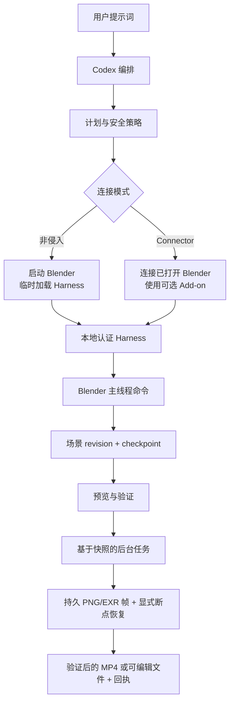

# Blender Design 插件

<p align="center">
  
</p>

<p align="center">
  <strong>说出想法，看着 Blender 完成设计，并拿走全部源文件。</strong><br>
  一个面向建模、动画、运镜、视觉验收、恢复和可信导出的安全本地 Harness。
</p>

<p align="center">
  <a href="README.md">English</a> ·
  <a href="README.zh-CN.md">简体中文</a> ·
  <a href="docs/getting-started.zh-CN.md">安装与使用</a> ·
  <a href="docs/verification/harness-runtime.md">运行证据</a>
</p>

## 项目定位

`blender-design` 让 Codex 通过一个受约束的本地 Harness 驱动真实的 Blender 会话。它不返回一次性图片，而是构建可编辑的场景对象、材质、灯光、相机、动画、检查点、预览和导出回执，全部由你保留。

Harness 是封闭的结构化命令面：默认禁止任意 Python，Blender 数据只在主线程修改，且每个不可逆操作都需要动作绑定的授权令牌。

### 适合谁

- 希望 Codex 帮忙搭场景、又不愿失去可编辑性的 3D 艺术家与技术美术。
- 需要可脚本化、可审计的 Blender 自动化面的管线工程师。
- 需要里程碑预览与导出回执、而不是"成功了"这类口头的审阅者。

### 解决什么问题

| 问题 | 本插件提供 | 可验证入口 |
|---|---|---|
| 自动化脚本会把场景弄坏 | 仅主线程修改、场景 revision、requestId | `scripts/harness/server.py`、`docs/Codex-Blender-Plugin-Architecture.md` |
| 某一步失败就毁掉文件 | 里程碑快照与回滚证据 | `scripts/harness/snapshot.py` |
| 长导出卡死会话 | 基于快照隔离的后台任务与显式续跑 | `docs/verification/harness-runtime.md` |
| "跑通了"无法核实 | 媒体探测、哈希、重导入校验、回执 | `scripts/harness/exporter.py` |
| 缺素材导致任务停滞 | 默认先索要；明确授权后才做带标注的替代设计 | `docs/getting-started.zh-CN.md` |

## 一眼看懂

```text
想法 / 参考素材 / 动作时间线
      │
      ▼
┌──────────────────────────────────────────────────────────┐
│ blender-design                                            │
│  ① plan     可执行设计与安全策略                         │
│  ② connect  非侵入启动，或 Connector Add-on              │
│  ③ build    在 Blender 主线程执行结构化命令              │
│  ④ review   里程碑预览与检查点                           │
│  ⑤ export   可信导出 .blend / .glb / .png / .mp4 + 回执  │
└──────────────────────────────────────────────────────────┘
      │
      ▼
可编辑的 Blender 场景 + 经验证的本地导出文件
```

| 项目属性 | 值 |
|---|---|
| 插件 ID | `blender-design` |
| 宿主 | Codex CLI 或 ChatGPT 桌面应用 |
| 当前版本 | `0.11.3` |
| 插件清单 | `.codex-plugin/plugin.json` |
| MCP 配置 | `.mcp.json` 在隔离用户 venv 中引导 SHA 锁定的 PartMe Blender MCP `v0.5.3` 与官方 MCP SDK，不维护第二套 MCP 实现 |
| 主要语言 | Python 3.13 Harness + Blender Add-on |
| 许可证 | Apache-2.0 |

## 能力与边界

### 已支持

| 能力 | 输入 | 输出 | 限制 | 状态 |
|---|---|---|---|---|
| 场景装配 | 想法、参考素材或时间线 | 集合、稳定对象 ID、变换、BMesh、曲线、Modifier | 仅限已批准的资产导入 | 稳定 |
| 建模与材质 | 设计意图 | 硬表面与程序化配方、UV、PBR 材质、Geometry Nodes、雕刻、Hair Curves、烘焙 | — | 稳定 |
| 绑定与动画 | 角色或道具意图 | Armature、权重、IK/FK、约束、Action、F-Curve、NLA、Shape Key、重定向 | — | 稳定 |
| 运镜与渲染 | 镜头意图 | 相机路径、手持响应、灯光、Eevee/Cycles、合成节点、passes、EXR 交付 | — | 稳定 |
| 仿真与序列 | 场景意图 | 刚体、布料、软体、Smoke、缓存烘焙、Grease Pencil、跟踪、VSE 时间线 | — | 稳定 |
| 后台任务 | 长导出或烘焙 | 带逐帧哈希的 PNG 或多层 EXR 序列、显式缺帧续跑 | 与实时场景快照隔离 | 稳定 |
| 导出 | 已批准的场景 | `.blend`、`.glb`、`.png`、H.264 `.mp4` 及回执 | 视频导出需要 FFmpeg 与 ffprobe | 稳定 |

### 两种连接方式

| 模式 | 是否安装 Blender Add-on | 适用场景 |
|---|---:|---|
| **非侵入模式（默认）** | 不需要 | 从零开始，Codex 启动 Blender 并临时加载 Harness |
| **Connector 模式** | 安装可选轻量 Add-on | 继续操作已经打开的 Blender 工程 |

运行时事实以 `capability.list` 和 `capability.describe` 为准。目录数量**按运行模式分别统计**，由命令注册表生成，并可由 `docs/verification/capability-counts.json` 复现。

- **非侵入模式（Managed）** 注册 167 条命令：其中 154 条 L3、3 条经 Windows 验证的恢复与 Rigify 命令达到 L4、10 条 L1、0 条 L2，横跨 35 个域，路由到 33 个内置 Skill 中的 23 个。
- **Connector 模式** 额外加入 5 条可选 `official_uploader.*` 命令：合计 172 条命令，154 条 L3、3 条 L4、15 条 L1、0 条 L2，横跨 36 个域，路由到 24 个 Skill。

两种模式**不合并为单一总数**，也不宣称任何综合覆盖率。Windows 前台 UI 接管未达到 L4 验证，详见[运行证据](docs/verification/harness-runtime.md)。

### 不负责

- 云端登录、报价、提交、轮询和付费操作——这些都在本插件之外。
- 捆绑或安装官方即梦上传器。它由用户自行启用；当前 macOS 验证环境未安装，因此即梦网页运行门禁记为阻塞，尽管其命令与 Skill 契约已通过离线验证。
- Autodesk Maya。Maya 不在本插件范围内。
- Windows 前台 UI 接管。当前 Windows Server 2025 x64 / Blender 5.2.1 后台恢复、Rigify、Named Pipe 与打包已通过 L4 工作流；交互式 Windows 桌面仍未验收。

### 成熟度

| 状态 | 含义 |
|---|---|
| 稳定 | 有自动化测试与运行证据，可用于真实工作 |
| 实验性 | 行为可能调整；依赖前请固定版本并自行验证 |
| 封锁 / NOT_RUN | 本机未验证；不得描述为可用 |

## 架构与核心流程



### 组件职责

| 组件 | 负责 | 不负责 |
|---|---|---|
| `scripts/launch_harness.py`、`scripts/managed_launcher.py` | 启动 Blender 并写入会话描述符 | 场景语义 |
| `scripts/harness/server.py` | 传输、会话、命令分发、检查点 | 领域建模 |
| `scripts/harness/execution_policy.py` | 判定哪些动作不可逆、需要授权 | 解读用户意图 |
| `scripts/harness/authorization.py` | 临时 HMAC 令牌、TTL、动作绑定 | 长期凭据 |
| `scripts/harness/exporter.py` | 可信导出与媒体探测 | 艺术决策 |
| `vendor/partme-blender-mcp-addon-0.5.3.zip` | 已打开会话的 PartMe Add-on 生命周期 | Codex 专属制作流程 |
| `vendor/partme-blender-mcp-runtime-0.5.3.zip` | 通用 MCP 协议与官方 SDK 工具暴露 | Codex 专属 Skills |
| `skills/`（33 个） | 供 Codex 使用的路由与领域指令 | 运行时约束 |

## 兼容性

| 插件版本 | 宿主 | Blender | 平台 | 状态 |
|---|---|---|---|---|
| `0.11.3` + runtime `0.5.3` | Codex CLI 或 ChatGPT 桌面应用 | Blender 4.2.23 CI 基线；Blender 5.2.1 可见 UI 验收 | macOS Apple Silicon（UDS 传输） | 通过 |
| `0.11.3` + runtime `0.5.3` | Codex CLI 或 ChatGPT 桌面应用 | Blender 5.2.1 后台 L4 工作流 | Windows Server 2025 x64（Named Pipe 传输） | 通过；不声称前台 UI 接管 |
| `0.11.3` + runtime `0.5.3` | Codex CLI 或 ChatGPT 桌面应用 | 同上 | Linux 无头（带 token 的 loopback TCP） | 实验性，不作为发布门禁 |

Windows 前台 UI 接管未达到 L4 验证。仅 `docs/verification/harness-runtime.md` 中列出的组合可以声称支持。

## 安装

### 1. 先安装 Blender

从 <https://www.blender.org/download/> 下载并安装 Blender，手工启动一次，确认能看到默认立方体。若需要视频导出，请安装 FFmpeg 与 ffprobe，并确保二者都在 `PATH` 上。

> **还没有 Blender？[下载安装包](https://www.blender.org/download/)**
>
> 打开 Blender，在 **偏好设置 > 插件** 中启用 MCP 插件，然后在 N 面板中点击
> **Start MCP Server**。

本插件的可信 Add-on 名称是 **PartMe Blender MCP**，来自锁定的上游 Release。完整图文步骤见
[首次使用指南](docs/getting-started.zh-CN.md)；另行安装的社区插件 **MCP for Blender** 不能
代替 PartMe 安全 Harness 连接。

### 2. 安装插件

```bash
codex plugin marketplace add https://github.com/full-aigc-plugins/blender-design-plugin.git --ref main
codex plugin add blender-design@partme-ai-blender
```

### 3. 连接已打开的 Blender（一次性设置）

安装 Codex 插件时，PartMe Blender MCP 服务端已经随插件一起安装，**不要再用 pip 安装
`partme-blender-mcp-*.tar.gz`，也不要把 pip 输出中的 `Processing ...` 当作命令执行**。

如果希望 Codex 连接已打开的 Blender 窗口，只需在 Blender 中安装一次随插件提供的
PartMe Add-on。让 Codex 执行“为我准备 Blender MCP 安装包”，或由熟悉命令行的用户运行：

```bash
python3 scripts/package_connector.py dist/partme-blender-mcp-addon-0.1.1.zip
```

随后在 Blender 中选择 **编辑 → 偏好设置 → 插件 → 从磁盘安装**，选择该 ZIP，启用
**PartMe Blender MCP**；回到 3D 视图，按 `N`，在 **PartMe MCP** 面板点击
**Start MCP Server**。这是 Blender 侧唯一需要人工完成的一次性操作。

### 确认加载成功

```bash
codex plugin list
```

预期条目：

```text
blender-design@partme-ai-blender  installed, enabled
```

然后让 Codex 以非侵入模式启动并列出能力。运行时事实以 Harness 本身为准：

```text
capability.list
capability.describe
```

目录由命令注册表生成、不手工维护，具体数量可由 `docs/verification/capability-counts.json` 复现。

### 国内镜像（AtomGit）

如果 GitHub 访问缓慢或不可达，可改用 AtomGit 镜像安装。命令完全一致，只把市场地址换成镜像：

```bash
codex plugin marketplace add https://github.com/full-aigc-plugins/blender-design-plugin.git --ref main
codex plugin add blender-design@partme-ai-blender
```

如需一步安装 partme-ai 全部插件目录：

```bash
codex plugin marketplace add https://github.com/partme-ai/full-aigc-plugins.git
codex plugin add blender-design@partme-ai-blender
```

注意事项：

- AtomGit 源与 GitHub 源共用市场名，后添加的会覆盖先添加的。切回官方源执行
  `codex plugin marketplace add https://github.com/partme-ai/full-aigc-plugins.git`。
- ZCode 与 Kimi 用户可先将镜像仓库克隆到本地，再在各平台的 marketplace 配置中登记本地目录。

## 快速开始

### 1. 前置条件

- 本机已安装且可启动 Blender。
- 需要 MP4 导出时，`PATH` 上有 FFmpeg 与 ffprobe。
- Harness 可用的 Python 3.13（CI 基线）。
- 磁盘空间足以容纳检查点快照与帧序列。

### 2. 启动非侵入会话

新建一个 Codex 任务并提出场景需求。下面这条最简提示词涵盖了建模、预览与导出：

```text
使用非侵入模式启动 Blender。设计一个橙色磨砂金属桌面音箱：圆角机身、黑色前网罩、
一个控制旋钮。先给我 Camera、Front、Side、Top 四视图；验证通过后，在指定输出目录
新建并导出 .blend、.glb 和 .png。
```

预期观察：Blender 启动、Harness 被临时加载、里程碑预览出现，导出步骤给出带文件哈希的回执。

### 3. 在已打开的 Blender 中继续

安装 Connector Add-on、打开你的工程，然后让 Codex 连接。暂停并接管让你可以直接手工编辑；恢复时 Codex 会强制重新检查现场，因此你的人工修改不会被旧状态覆盖。

## 配置

### 环境变量

| 变量 | 用途 | 默认值 |
|---|---|---|
| `CODEX_BLENDER_DESCRIPTOR` | Harness 会话描述符路径 | 由启动器写入 |
| `CODEX_BLENDER_RUNTIME_DIR` | 覆盖运行时目录 | Harness 默认目录 |
| `CODEX_BLENDER_FFMPEG` | 覆盖 FFmpeg 可执行文件 | `PATH` 上的 `ffmpeg` |
| `CODEX_BLENDER_FFPROBE` | 覆盖 ffprobe 可执行文件 | `PATH` 上的 `ffprobe` |

### 配置文件

| 文件 | 用途 |
|---|---|
| `config/blender-release-matrix.json` | 受支持的 Blender 版本 |
| `config/production-profile.json` | 从生产目录中排除的域与命令类 |

本插件没有任何 API Key。会话授权使用会话启动时生成的临时 HMAC 令牌，默认 TTL 为 60 秒，且绑定到具体动作。

## Harness 契约

### 会话生命周期

| 阶段 | 输入 | 必须完成 | 失败语义 |
|---|---|---|---|
| `launch` | Blender 路径、运行时目录 | 启动 Blender 并加载 Harness | 启动失败，不留半加载会话 |
| `handshake` | 会话描述符 | 完成认证并注册能力 | 会话标记为不可用 |
| `execute` | 结构化命令 | 在主线程修改并递增场景 revision | 返回稳定错误码 |
| `pause / takeover` | 用户操作 | 把控制权交回艺术家 | Harness 保持连接 |
| `resume` | 继续请求 | 修改前重新检查现场 | 绝不套用过期状态 |
| `shutdown` | 停止请求 | 落盘检查点并关闭传输 | 超时后安全终止 |

### 稳定错误码

| 错误码 | 含义 | 是否可重试 |
|---|---|---|
| `UNKNOWN_COMMAND` | 命令不在注册表中 | 否 |
| `INVALID_ARGUMENT` | 参数未通过校验 | 否 |
| `INVALID_COMMAND_DEFINITION` | 注册表条目定义非法 | 否 |
| `DUPLICATE_COMMAND` | 命令名重复注册 | 否 |
| `INVALID_COMMAND_RESULT` | 处理函数返回了非法结果 | 否 |
| `UNKNOWN_CAPABILITY` | 当前会话未声明该能力 | 否 |
| `SESSION_REVOKED` | 授权令牌被拒或已过期 | 需重新授权 |
| `SESSION_CONTROL_CHANGED` | 控制权已被其他参与方持有 | 重新检查现场后再继续 |

不可逆操作需要动作绑定授权：`delete`、`overwrite`、`expert_python`、`path_escape`、`budget_exceeded`、`recovery_resubmit`。

## 重试、幂等与恢复

- requestId 防止重复执行；场景 revision 防止过期写入。
- 里程碑快照提供回滚证据；事务日志 `<runtime_dir>/recovery.json` 驱动"不重跑"的恢复。
- 后台任务基于快照隔离：在已提交的场景状态上运行，提供状态查询与取消，且绝不自行重启任务。
- 逐帧哈希让缺失帧可被检出，因此续跑只重渲缺失部分。
- 授权令牌一次一用且带时限；过期令牌会直接失败，而不是重放动作。

## 数据与状态

| 数据 | 位置 | 生命周期 | 是否含秘密 |
|---|---|---|---|
| 会话描述符 | `<runtime_dir>/<session_id>.json` | 会话范围内；正常关闭即删除 | 仅含临时 HMAC 令牌 |
| 事务日志 | `<runtime_dir>/recovery.json` | 直到会话结束或被丢弃 | 否 |
| 场景检查点 | 运行时目录的快照存储 | 直到你删除 | 否 |
| 渲染产物 | 你选择的导出目录 | 直到你删除 | 否 |
| 工程源文件 | 你的 `.blend` 与素材 | 绝不静默覆盖 | 否 |

## 安全

- 封闭的结构化命令白名单；默认禁止任意 Python，执行需显式 `expert_python` 授权。
- Blender 数据只在主线程修改，避免后台线程写入导致的场景损坏。
- 传输层在 macOS 使用私有 Unix domain socket，Windows 使用 Named Pipe，带 token 的 loopback TCP 仅作降级。
- 授权声明经 HMAC 签名、带 TTL，并绑定到单一动作。
- 删除、覆盖、扩展格式与外部动作都需要动作绑定授权。
- 插件不捆绑任何凭据，Harness 也不向磁盘写入凭据。

## 开发与验证

```bash
python3 -m unittest discover -s tests
python3 scripts/validate_distribution.py .
```

其他校验器：

```bash
python3 scripts/validate_document.py
python3 scripts/validate_model_in_blender.py
```

仓库中已记录的证据：

- [运行证据](docs/verification/harness-runtime.md)——本机 macOS 基线的 L3/L4/L1 明细。
- [Windows L4 与 Rigify 证据](docs/verification/windows-l4-rigify.md)——Windows Server 2025 x64 / Blender 5.2.1 后台验收；不声称前台 UI 接管。
- [官方上传器运行记录](docs/verification/official-uploader-runtime.md)——记录 `BLOCKED_MISSING_OFFICIAL_ADDON`。
- [能力计数](docs/verification/capability-counts.json)——机器可校验的命令清单。
- `docs/verification/` 还包含领域覆盖矩阵、前台生命周期与策略记录，以及验收测试记录。

## 故障排查

| 现象 | 优先检查 | 处理方式 |
|---|---|---|
| Blender 没有启动 | Blender 安装与 `PATH` | 安装 Blender 后重跑非侵入模式 |
| 视频导出失败 | FFmpeg 与 ffprobe | 二者都安装，或设置 `CODEX_BLENDER_FFMPEG` / `CODEX_BLENDER_FFPROBE` |
| 命令返回 `UNKNOWN_COMMAND` | 当前会话的 `capability.list` | 使用已声明的命令，或切换连接模式 |
| 命令返回 `SESSION_REVOKED` | 授权 TTL | 重新授权该动作 |
| 恢复行为不符合预期 | 暂停后是否有手工修改 | 恢复时强制重新检查现场是设计行为，请重新表达意图 |
| 即梦网页路径不可用 | 是否存在官方上传器 | 上传器需用户自行安装；未安装时门禁保持阻塞 |
| 期望 Windows 对齐 | 平台证据 | 后台恢复、Rigify、Named Pipe 与打包已验证；前台 UI 接管仍需交互式 Windows 验收 |

## 项目结构

```text
partme-blender-plugin/
├── .codex-plugin/plugin.json   # 身份、展示元数据、回执契约版本
├── .agents/plugins/marketplace.json
├── bin/blender_adapter         # 仅预览的桥接适配器
├── connector/                  # 可选 Blender Add-on
├── scripts/                    # Harness、启动器、导出器、校验器
│   └── harness/                # 传输、服务、策略、授权、快照
├── skills/                     # 33 个领域与工作流 Skill
├── config/                     # 版本矩阵与生产档位
├── tests/                      # 单元、契约与分发测试
└── docs/                       # 架构、技术方案、验证记录
```

## 深入文档

- [Architecture](docs/Codex-Blender-Plugin-Architecture.md) · [架构文档](docs/Codex-Blender-Plugin-Architecture.zh_CN.md)
- [Technical solution](docs/Codex-Blender-Plugin-Technical-Solution.md) · [技术方案](docs/Codex-Blender-Plugin-Technical-Solution.zh_CN.md)
- [安装与使用（中文）](docs/getting-started.zh-CN.md)
- [Harness 设计规格](docs/superpowers/specs/2026-09-12-blender-design-harness-design.md)
- [实施计划](docs/superpowers/plans/2026-09-12-blender-design-harness-implementation.md)
- [运行证据](docs/verification/harness-runtime.md)

## 贡献与支持

功能问题请提交到 <https://github.com/full-aigc-plugins/blender-design-plugin/issues>。提交变更前，请说明你验证所用的 Blender 版本与平台、是否改动命令注册表或授权策略，并附上受影响的测试。新增命令必须注册进注册表，不得以自由 Python 形式加入。

## 许可证

Apache-2.0，见 [LICENSE](LICENSE)。
