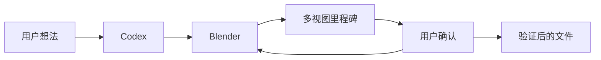

# Codex Blender 插件


> 让 Codex 通过安全的本地 Harness 完成 Blender 设计、视觉验收、保存和导出。

[English](README.md) | [简体中文](README.zh-CN.md)

## 能做什么

`codex-blender` 把用户想法转化为 Blender 场景，覆盖结构化建模、材质、灯光、相机、
动画、里程碑预览、恢复检查点和多格式文件交付。



## 两种运行模式

- **非侵入模式（默认）**：Codex 启动 Blender 并临时加载 Harness，不安装 Blender Add-on。
- **Connector 模式**：安装可选轻量连接器，控制已经打开的 Blender 场景。

两种模式共用相同的本地认证协议、命令白名单、revision、事务和回执。

## 当前能力

- 场景只读检查
- 基础网格创建和 Transform
- 重命名、父子关系、删除和 Modifier
- PBR 材质和材质分配
- 相机、灯光、帧范围和关键帧
- Camera、Front、Side、Top 四视图里程碑
- BLEND、GLB、GLTF、FBX、OBJ、STL、PNG、JPG、MP4 导出路由

## 安全边界

- 默认只允许封闭结构化命令，不直接运行任意 Python
- Blender 数据修改只在主线程执行
- revision 防止基于旧场景继续修改
- requestId 防止重复执行
- 删除、覆盖和最终导出需要动作绑定授权
- macOS 使用私有 UDS，Windows 使用 Named Pipe，loopback TCP 仅作带 token 降级
- 每个里程碑建立快照并保留恢复证据

## 安装

先从 [Blender 官网](https://www.blender.org/download/) 安装 Blender，再从 GitHub 安装插件：

```bash
codex plugin marketplace add https://github.com/partme-ai/codex-blender-plugin.git --ref main
codex plugin add codex-blender@partme-ai-blender
```

详细步骤见[安装与使用指南](docs/getting-started.zh-CN.md)。

## 产品边界

本插件止于经过验证的本地 Blender 文件。下游 AI 渲染、账号登录、报价、提交、查询和
付费行为属于其他编排插件。若提示词缺少必要参考素材，默认要求用户提供；用户明确要求
原创设计时，才创建并标记 Blender 设计代理。完成后始终给出可验证的交付清单，并由用户
选择结束，或交给 `codex-dreamina-3d-plugin` 做下游渲染。

## 开发验证

```bash
python3 -m unittest discover -s tests -v
python3 scripts/validate_distribution.py
python3 scripts/package_connector.py dist/codex-blender-connector.zip
```

- [Harness 设计规格](docs/superpowers/specs/2026-09-12-codex-blender-harness-design.md)
- [实施计划](docs/superpowers/plans/2026-09-12-codex-blender-harness-implementation.md)
- [运行验证记录](docs/verification/harness-runtime.md)

## 许可证

Apache-2.0，见 [LICENSE](LICENSE)。
