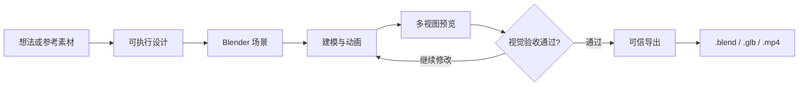
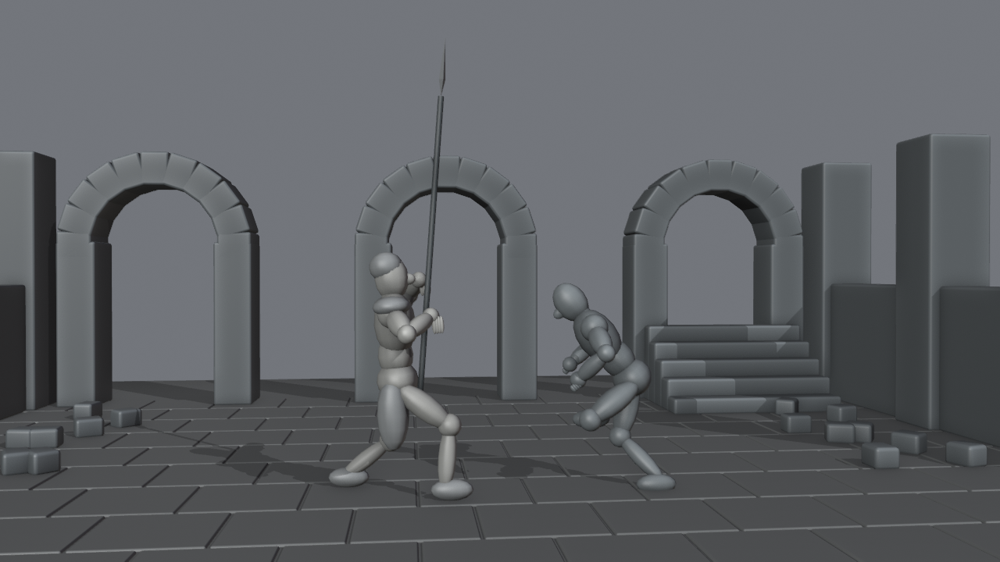
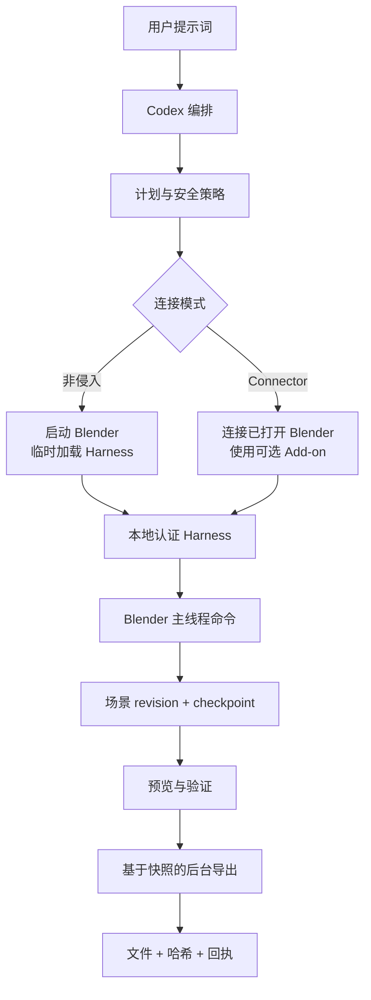

# Codex Blender 插件

<p align="center">
  
</p>

<p align="center">
  <strong>说出想法，看着 Blender 完成设计，并拿走全部源文件。</strong><br>
  一个面向建模、动画、运镜、视觉验收、恢复和可信导出的安全本地 Harness。
</p>

<p align="center">
  <a href="README.md">English</a> ·
  <a href="README.zh-CN.md">简体中文</a> ·
  <a href="docs/getting-started.zh-CN.md">安装与使用</a> ·
  <a href="docs/verification/harness-runtime.md">运行证据</a>
</p>

## 从一句提示词到可编辑的 Blender 交付物

给 Codex 一个想法、一组参考素材或一条动作时间线。插件把它转换成真正的 Blender 工作，而不是一次性图片：场景对象、材质、灯光、相机、动画、检查点、预览和导出回执都会保留下来。



提示词缺少引用素材时，默认要求补充。只有你明确允许原创设计代理，Codex 才会在 Blender 中替代设计缺失的角色、道具、场景或动作参考，并在交付清单中逐项标注假设。

## 案例：8 秒长矛动作白模

仓库的端到端验证不是只跑命令，而是实际完成了一次从设计到出片的闭环：

1. 先把文字提示词整理成两个角色、唯一一根长矛、五段动作、8 秒时长和低机位手持路线。
2. Codex 在 Blender 中搭建可编辑白模，完成进攻与受击动画，并检查取景、关键帧、时长和单一道具约束。
3. Blender 导出 `.blend` 源文件和可播放的 H.264 白模预览。
4. 用户明确选择跨插件交接后，才把验证通过的白模作为动作参考，进入独立的下游成片流程。

<table>
  <tr>
    <th>可编辑 Blender 白模</th>
    <th>可选下游成片</th>
  </tr>
  <tr>
    <td></td>
    <td></td>
  </tr>
</table>

<p align="center">
  <a href="assets/showcase/spear-fight-white-model-preview.mp4"><strong>▶ 播放 8 秒白模视频</strong></a>
  &nbsp;&nbsp;·&nbsp;&nbsp;
  <a href="assets/showcase/spear-fight-final-preview.mp4"><strong>▶ 播放 8 秒下游成片</strong></a>
</p>

仓库内放置的是轻量 640×360 宣传预览，避免 README 加载过慢。`codex-blender` 负责左侧交付：可编辑的 Blender 场景与验证后的本地文件。右侧视频只是在明确选择 `codex-dreamina-3d` 后得到的独立下游示例；云端登录、报价、提交、轮询和付费操作不属于本插件。

## 两条命令完成安装

1. 从 [Blender 官网](https://www.blender.org/download/) 下载并安装 Blender，手工启动一次，确认能看到默认立方体。
2. 从 GitHub Marketplace 安装插件：

```bash
codex plugin marketplace add https://github.com/partme-ai/codex-blender-plugin.git --ref main
codex plugin add codex-blender@partme-ai-blender
```

新建一个 Codex 任务，然后试试：

```text
使用非侵入模式启动 Blender。设计一个橙色磨砂金属桌面音箱：圆角机身、黑色前网罩、
一个控制旋钮。先给我 Camera、Front、Side、Top 四视图；验证通过后，在指定输出目录
新建并导出 .blend、.glb 和 .png。
```

截图版安装、Connector、素材缺失策略、自动执行和交付回执说明见[安装与使用指南](docs/getting-started.zh-CN.md)。

## 两种连接方式

| 模式 | 是否安装 Blender Add-on | 适用场景 |
|---|---:|---|
| **非侵入模式（默认）** | 不需要 | 从零开始，Codex 启动 Blender 并临时加载 Harness |
| **Connector 模式** | 安装可选轻量 Add-on | 继续操作已经打开的 Blender 工程 |

两种模式共用相同的本地认证协议、封闭命令注册表、场景 revision、事务和交付回执。



新的混合架构让 Blender 保持前台可见、可交互；耗时导出基于已提交快照安全地放到后台。你可以暂停并接管场景，恢复时 Codex 会重新检查现场，不会拿旧状态覆盖人工修改。

## 可以做什么

- 场景装配、集合、稳定对象 ID、局部/世界变换、BMesh、曲线、Modifier 和授权资产导入
- 硬表面与程序化配方、UV、PBR 材质、Geometry Nodes、雕刻、Hair Curves 和贴图烘焙
- Armature、权重、IK/FK、约束、Action、F-Curve、NLA、Shape Key、重定向和单一道具交接
- 相机路径、手持响应、灯光、Eevee/Cycles、合成节点、passes 与 EXR 交付
- 刚体、布料、软体、Smoke、隔离缓存烘焙、Grease Pencil、跟踪与 VSE 时间线
- 快照隔离后台任务、状态查询、取消和不自动重跑的恢复

运行时事实以 `capability.list` 和 `capability.describe` 为准。当前 macOS Blender 5.2.1 基线共注册 156 条工具，其中 131 条有 L3 证据、25 条保持 L1，并精确路由到 22 个 Skill。工具、Skill 与平台覆盖分别统计，不宣称综合“100%”。Rigify 未安装时 generate 明确不可用，Windows 尚未达到 L4。详见[运行验证记录](docs/verification/harness-runtime.md)。

## 安全不是附加项

- 默认只允许封闭结构化命令，不直接运行任意 Python
- Blender 数据修改只在主线程执行
- revision 防止旧状态写入，requestId 防止重复执行
- 删除、覆盖、专家 Python、扩展格式和外部动作使用动作绑定授权
- macOS 使用私有 UDS，Windows 使用 Named Pipe，loopback TCP 仅作带 token 降级
- 每个里程碑建立快照，并提供回滚证据、媒体探测、哈希及必要的重导入验证

## 三个交付入口

- `preview_only`：创建并验证本地 Blender 预览。
- `jimeng_web`：在前台 Connector 中单次调用用户已启用的官方上传器，止于 `JimengLinkReady`。
- `downstream_seedance`：将验证后的回执交给 `codex-dreamina-3d`，进入另行授权的生成流程。

本仓库不捆绑或安装官方上传器。当前 macOS 验证环境未启用该插件，所以即梦网页运行门禁明确记录为阻塞；命令与 Skill 契约已通过离线验证。

## 开发与验证

```bash
python3 -m unittest discover -s tests -v
python3 scripts/validate_distribution.py
python3 scripts/package_connector.py dist/codex-blender-connector.zip
```

- [Harness 设计规格](docs/superpowers/specs/2026-09-12-codex-blender-harness-design.md)
- [实施计划](docs/superpowers/plans/2026-09-12-codex-blender-harness-implementation.md)
- [运行验证记录](docs/verification/harness-runtime.md)

## 许可证

Apache-2.0，见 [LICENSE](LICENSE)。
