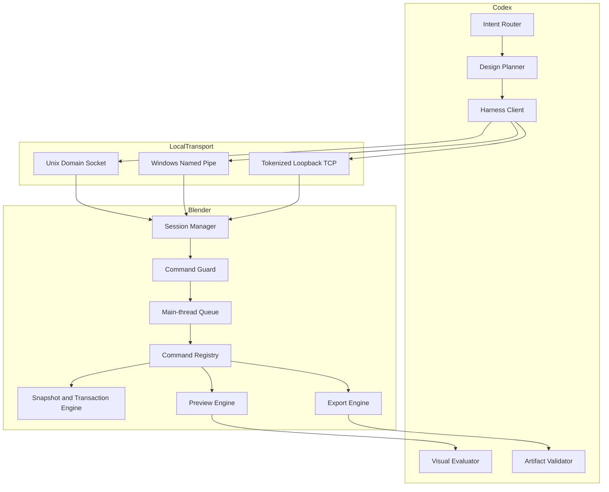

# Codex Blender Plugin Architecture

## Status

Delivered architecture. This document describes the current Harness design for
`codex-blender` version `0.3.0`. It supersedes the Jimeng-uploader-oriented
architecture, which is archived under `docs/archive/legacy-uploader/`. The
authoritative design record is
[Codex Blender Harness Design](superpowers/specs/2026-09-12-codex-blender-harness-design.md).

## Drivers

Codex can already describe a scene in words. What it cannot do reliably is turn
that description into a real Blender deliverable with evidence. The failure
modes that drove this architecture were: an agent mutating a user's scene with
no rollback path, claiming success from a command exit code rather than from a
verified artifact, and mixing paid remote generation into a local modelling
tool.

The plugin therefore optimises for three properties in this order: the user's
scene is never lost, every claim is backed by an artifact receipt, and the
boundary between local Blender work and paid downstream generation is explicit
rather than implied.

## Scope and non-goals

`codex-blender` owns Blender discovery and session creation or attachment; scene,
object, modifier, material, camera, light, animation, preview, save, and export
operations; milestone screenshots and review checkpoints; transaction snapshots,
rollback, revision control, and audit records; and structured artifact receipts
carrying size, `SHA-256`, parameters, and validation status.

It does not own Dreamina login, quotation, approval, submission, polling, paid
generation, or final Dreamina artifact download. Those belong to
`codex-dreamina-3d` and its companion design plugin. No Blender export implies a
handoff, an upload, an authentication step, a quotation, or a paid action.

## Context and trust boundary



The trust boundary sits at the local transport. Everything on the Codex side is
untrusted input to Blender: it is parsed, validated against a closed command
allowlist, and path-checked before it can reach a mutating operation. Blender
never accepts a command that is not registered, and it never accepts a mutation
that does not carry the scene revision it expects.

## Component responsibilities

| Component | Owns |
|---|---|
| `session.*` registry | capabilities, status, close, audit summary |
| Command guard | closed allowlist, revision check, path containment, authorization claim |
| Main-thread queue | queuing mutations and executing them on Blender's timer callback |
| Transaction engine | milestone snapshots, rollback, revision counters, recovery checkpoints |
| Preview engine | camera, front, side, and top screenshots plus animation sample frames |
| Export engine | format-specific writers, atomic receipt and status files |
| Visual evaluator | judging fresh images rather than trusting command success |
| Artifact validator | independent re-import and media probing of each export |

## Dependency direction

Dependencies point inward, from transport to protocol to core to Blender:

```text
transport (UDS / Named Pipe / loopback TCP)
  -> session handshake and protocol negotiation
    -> command guard
      -> main-thread queue
        -> command registry
          -> transaction, preview, and export engines
            -> Blender Python API
```

No engine reaches back into transport. No Blender data is touched off the main
thread. The managed and Connector modes differ only in startup and transport
discovery; they share the command registry, guardrails, transaction engine,
preview engine, and export engine.

## Main flow

1. Codex converts a request into an implementation brief: supplied assets,
   required but missing assets, object and uniqueness constraints,
   scene and environment, camera route, animation beats, duration, output
   formats, and acceptance checks.
2. The session opens, negotiates `codex-blender/v1`, and registers capabilities.
3. A milestone begins with a lightweight snapshot and a persistent recovery
   checkpoint.
4. Mutating commands are queued, executed on the main thread, checked against
   `expectedSceneRevision`, and committed with a revision increment.
5. Each completed stage emits fresh camera, front, side, and top images plus a
   scene summary. Animation additionally emits first, middle, and last frames.
6. Codex evaluates the fresh images. Command success alone is not design
   acceptance.
7. On completion the plugin presents an artifact inventory — path, format, bytes,
   `SHA-256`, scene revision, snapshot, validation evidence, and unresolved
   deviations — and asks the user to either finish locally or explicitly request
   a handoff.

## Failure and recovery

| Failure | Behaviour |
|---|---|
| Unregistered command | Fails closed; no dispatch |
| Stale `expectedSceneRevision` | Rejected before mutation |
| Duplicate non-idempotent `requestId` | Returns the prior response without re-executing |
| Path escaping an approved root | Rejected after canonical resolution |
| Mutation raising mid-transaction | Current transaction rolls back; restoration status is reported |
| Blender crash | Recovery reopens the last checkpoint and replays only committed idempotent commands |
| Validation failure | Stops for recovery rather than continuing the plan |
| Pause or takeover | Acts between commands, cancels queued work, invalidates active transactions and export approvals, and requires reinspection |

Rollback never reverts edits the user made by hand. Session revoke and loading a
different file both stop the session.

## Runtime modes

**Managed mode** launches Blender and loads a temporary bootstrap script. No
Blender preference and no Add-on installation is written. The process stays alive
for the design session.

**Connector mode** is a lightweight Add-on exposing the same Harness inside an
already-open Blender process. It reports connection status, start and stop,
active-session identity, and a visible revoke control. It contains no Dreamina
code and never enables arbitrary remote access.

## Platforms and transport

| Platform | Status | Preferred transport |
|---|---|---|
| macOS Apple Silicon | release gate | Unix Domain Socket |
| Windows x64 | release gate | Named Pipe |
| Linux | experimental | tokenized loopback TCP |

Both release-gate platforms also support tokenized `127.0.0.1` TCP as a fallback.
Every session uses a random 256-bit secret, restrictive socket or pipe
permissions, idle expiry, request-size limits, and protocol-version negotiation.

## Security

- Closed command allowlist; unknown commands fail closed.
- No network listener outside the local transports; TCP binds only to loopback.
- Approved project, asset, and output roots are enforced after canonical path
  resolution, so symlinks and traversal cannot escape them.
- Requests and responses are size bounded, and secrets are never logged.
- Expert Python (`advanced.execute_python`) is disabled by default, statically
  scanned, network and subprocess restricted, checkpointed, hashed, audited, and
  executed only after an explicit action-bound authorization.
- The Connector stops accepting commands when Blender switches to an unapproved
  file.

## Reliability

Milestone approval binds `sceneRevision + snapshotId`, and the final export must
use that bound revision. Long animation output is split so that frame production
(`RENDER_ANIMATION_FRAMES`) and video composition (`COMPOSE_VIDEO`) are separate
durable jobs; composition consumes only a complete, hash-verified
`FrameSequenceReceipt`, and explicit resume reuses verified frames while
replacing only missing or corrupt entries. Model exports are re-imported into an
isolated scene for structural validation, and media outputs are probed
independently.

## Deployment

The plugin ships as a Codex plugin with the manifest at
`.codex-plugin/plugin.json` and the skills under `skills/`. There is no daemon
and no installed service: Blender is launched on demand, and the Connector Add-on
is installed by the user into their own Blender when they choose that mode.

## Observability

Every session exposes capabilities, status, and an audit summary. Each completed
stage emits images that a human or an agent can re-inspect, and every export
writes an atomic receipt alongside the artifact. The Connector panel shows the
actual scene and session identity, the execution policy, the stage and progress
reported by the caller, the last executed command, changed objects, and errors.
Progress reported as a percentage is never promoted to verified completion.

## Compatibility matrix

| Dimension | Supported |
|---|---|
| Blender | 5.2.1 LTS verified on the release-gate platforms |
| Protocol | `codex-blender/v1` |
| Model exports | `.blend`, `.glb`, `.gltf`, `.fbx`, `.obj`, `.stl` |
| Raster exports | `.png`, `.jpg` |
| Video | H.264 `.mp4` via a verified frame sequence |
| Version-probed | EXR, USD, Alembic |
| Execution policy | `interactive`, `auto_with_budget`, `review_only` |

Omitted policy remains `interactive` for backwards compatibility.

## Evolution

The archived uploader-era design is not a fallback path; it is superseded. Future
increments extend the command registry and the export contract rather than
reintroducing Dreamina behaviour into this plugin. Animation-authoring upgrades,
motion-quality evaluation, and background export workers are the next declared
increments. Because the command contract is closed and versioned, adding a
capability is an additive change to the registry plus its schema and tests.

## Acceptance evidence

Runtime evidence is recorded under `docs/verification/`. The Harness runtime note
in [harness-runtime.md](verification/harness-runtime.md) records the verified
macOS Apple Silicon gates: managed foreground mode without Add-on installation,
Connector lifecycle, main-thread dispatch, milestone previews, every model and
raster export, H.264 `MP4`, transaction rollback with an injected failure, and
independent model re-import validation.

It also records what is **not** accepted: Windows x64 managed mode and Connector
runtime remain `NOT RUN` because they require a Windows Blender host. This
document does not claim them.

The phased P0–P9 acceptance record is in
[full-plan-completion.md](verification/full-plan-completion.md), and the
capability catalogue baseline is in
[capability-catalog-baseline.md](verification/capability-catalog-baseline.md).
