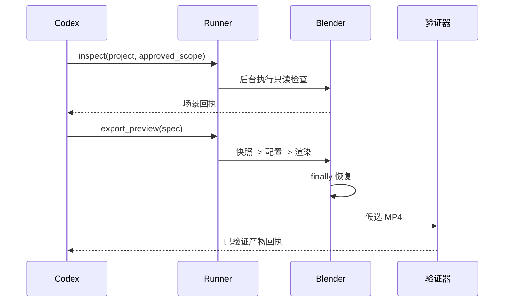

# Codex Blender 插件架构

> **状态**：目标架构，尚未实现。**版本**：0.1 设计稿。**更新日期**：2026-09-11。

## 1. 架构驱动与范围

插件必须让 Blender 自动化具备可观察、可恢复、可审查的执行边界。范围包括本地工程检查和预览视频导出，不包括云端上传、付费生成、自动安装 Blender 和任意脚本执行。

## 2. 系统上下文

Codex 进入本地 Blender 进程时形成第一条信任边界，打开 `.blend` 文件时形成第二条。默认不信任工程内嵌脚本。

## 3. 组件职责

| 组件 | 负责 | 不负责 |
|---|---|---|
| Skills | 意图路由、授权、用户侧恢复 | Blender 内部实现 |
| 能力探针 | 可执行文件、版本、特性 | 安装软件 |
| 进程运行器 | argv、超时、取消、回执 | Shell 字符串求值 |
| 场景 Bridge | 相机、帧范围、材质检查和临时修改 | 远程上传 |
| 预览导出器 | Workbench 帧和 MP4 组装 | 付费生成 |
| 媒体验证器 | 编码、尺寸、帧率、时长、大小 | 创意质量判断 |
| 状态恢复器 | 快照和确定性恢复 | 持久化场景重设计 |

## 4. 核心流程

取消或超时会终止子进程、保留既有产物、清理部分临时文件，并报告是否观察到恢复完成；不会静默重试渲染。

## 5. 契约

`SceneReceipt` 包含 Blender 版本、工程指纹、相机、帧范围、分辨率、材质预览能力和警告。`ArtifactReceipt` 包含已批准输出路径、SHA-256、编码、尺寸、帧率、时长、字节数、来源相机和帧范围。

## 6. 安全与可靠性

- 使用 argv 数组，不拼接 Shell 命令。
- 解析工程和输出路径，拒绝路径穿越与符号链接逃逸。
- 默认关闭 Blender 自动执行脚本。
- 记录修改前配置，并恢复每个被修改字段。
- 不保存凭据，不输出完整私有场景内容。
- 使用有界超时和明确取消回执。

## 7. 部署与兼容性

Codex 包只包含 Skills 和本地脚本，Blender 由用户维护。兼容性必须来自实际 Blender/OS 组合测试；设计阶段不声明已支持版本。

## 8. 演进

V1 聚焦预览导出。Geometry Nodes 检查或受控编辑必须经过新契约和测试后才能加入。Dreamina 联动由 `dreamina-3d` 负责。
