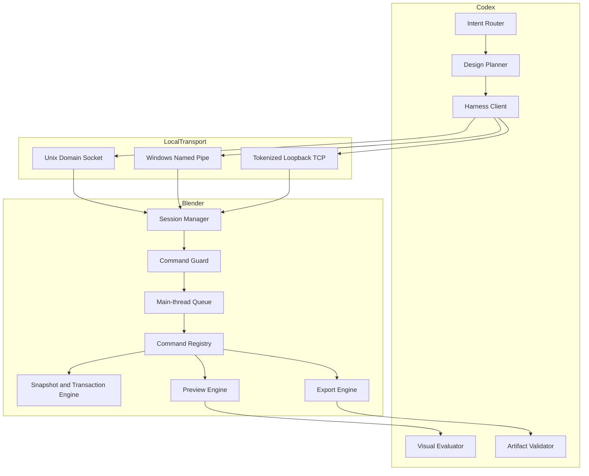

# Blender Design 插件架构

> **文档信息**
>
> | 字段 | 值 |
> |---|---|
> | 状态 | `blender-design` `0.3.0` 的已交付架构 |
> | 取代 | 面向即梦上传器的旧架构，归档于 `docs/archive/legacy-uploader/` |
> | 权威设计记录 | [Blender Design Harness Design](superpowers/specs/2026-09-12-blender-design-harness-design.md) |
> | 运行证据 | [harness-runtime.md](verification/harness-runtime.md) |
> | 最近一次结构修订 | 2026-09-14 |

## 1. 执行摘要

Codex 已经能用语言描述场景。它做不到的是把描述可靠地变成带证据的真实 Blender 交付物。本架构定义了一个受约束的本地 Harness 来补上这一环：Codex 负责规划，Blender 执行封闭的命令注册表，每一项声明都有产物回执支撑。

本插件按优先级优化三个性质：用户场景永不丢失；每一项声明都有产物回执支撑；本地 Blender 工作与付费下游生成之间的边界是显式的，而不是隐含的。

## 2. 驱动力与约束

推动本架构的失效模式有三个：Agent 修改用户场景却没有回滚路径；把命令退出码当作成功证据而不是验证过的产物；以及把付费远程生成混进本地建模工具。

| 驱动力 | 对架构的后果 |
|---|---|
| 用户场景绝不能丢 | 只在主线程修改、里程碑快照、回滚与修订守卫 |
| 退出码不是证据 | 接受之前先出新鲜预览，再做独立重导入与媒体探测 |
| 本地工作与付费工作不能混 | 任何导出都不隐含交接、上传、认证、报价或付费动作 |
| 自动化不能变成任意执行 | 封闭命令注册表，专家 Python 默认关闭 |

## 3. 范围与非目标

`blender-design` 负责：发现 Blender 并创建或接入会话；场景、对象、修改器、材质、相机、灯光、动画、预览、保存与导出操作；里程碑截图与评审检查点；事务快照、回滚、修订控制与审计记录；以及承载大小、`SHA-256`、参数与校验状态的结构化产物回执。

它不负责 Dreamina 登录、报价、批准、提交、轮询、付费生成或最终产物下载。这些属于 `codex-dreamina-3d` 及其配套设计插件。任何 Blender 导出都不隐含交接、上传、认证、报价或付费动作。

## 4. 上下文与信任边界



信任边界落在本地传输层。Codex 一侧的一切对 Blender 都是不可信输入：先解析、再按封闭命令白名单校验、再做路径检查，然后才可能抵达写类操作。Blender 绝不接受未注册的命令，也绝不接受未携带其所期望场景 revision 的修改。

## 5. 当前状态、目标状态与差距

| 能力 | 当前 | 目标 | 差距 |
|---|---|---|---|
| macOS Apple Silicon 非侵入模式 | 已有记录的运行证据 | 不变 | 无 |
| macOS Connector 生命周期 | 已验证 | 不变 | 无 |
| 模型、栅格与 H.264 导出 | 已验证，含重导入与探测 | 不变 | 无 |
| 注入失败下的事务回滚 | 已验证 | 不变 | 无 |
| Windows x64 非侵入模式与 Connector | `NOT RUN`；需要 Windows Blender 主机 | 在 Windows 上验证 | 本机无记录 |
| Windows 前台 UI 接管 | 未达 L4 验证 | 已验证 | 无记录 |
| 官方上传器运行期 | `BLOCKED_MISSING_OFFICIAL_ADDON` | 用户安装后可用 | 用户自装依赖 |
| Linux | 实验性，不作为发布门禁 | 不变 | 无 |

本文档只声称 [harness-runtime.md](verification/harness-runtime.md) 中记录过的组合。

## 6. 原则与决策

| 决策 | 理由 | 反转条件 |
|---|---|---|
| 只在 Blender 主线程修改 | 跨线程写入会以难以察觉的方式破坏场景数据 | 无 |
| 用封闭命令注册表代替自由 Python | 让每项能力可审计、每个参数经过 schema 校验 | 无 |
| 每次修改都带场景 revision | 防止过期计划覆盖更新的场景 | 无 |
| 里程碑工作之前先快照 | 崩溃后必须可恢复，而不必重放整个会话 | 无 |
| 验证导出，而不是相信退出码 | 写入器可能"成功"却产出不可用文件 | 无 |
| 付费工作不进本插件 | 下游插件已经拥有批准与计费 | 无 |

## 7. 组件与依赖

| 组件 | 负责 |
|---|---|
| `session.*` 注册表 | 能力、状态、关闭、审计摘要 |
| 命令守卫 | 封闭白名单、revision 校验、路径收敛、授权声明 |
| 主线程队列 | 排队修改并在 Blender 定时回调中执行 |
| 事务引擎 | 里程碑快照、回滚、修订计数、恢复检查点 |
| 预览引擎 | 相机、正面、侧面、顶部截图与动画抽样帧 |
| 导出引擎 | 各格式写入器、原子回执与状态文件 |
| 视觉评估器 | 评判新鲜图像，而不是相信命令成功 |
| 产物校验器 | 对每次导出做独立重导入与媒体探测 |

依赖方向朝内，从传输到协议到核心再到 Blender：

```text
transport (UDS / Named Pipe / loopback TCP)
  -> session handshake and protocol negotiation
    -> command guard
      -> main-thread queue
        -> command registry
          -> transaction, preview, and export engines
            -> Blender Python API
```

没有任何引擎反向进入传输层。没有任何 Blender 数据在主线程之外被触碰。非侵入模式与 Connector 模式的差别只在启动与传输发现；二者共享命令注册表、守卫、事务引擎、预览引擎与导出引擎。

## 8. 运行期与核心流程

### 8.1 主流程

1. Codex 把需求转换成实现简报：已提供素材、必需但缺失的素材、对象与唯一性约束、场景与环境、相机路线、动画节拍、时长、输出格式与验收检查。
2. 会话打开、协商 `codex-blender/v1` 并注册能力。
3. 里程碑开始时先做轻量快照与持久恢复检查点。
4. 写类命令入队、在主线程执行、按 `expectedSceneRevision` 校验，并以递增 revision 提交。
5. 每个阶段完成后输出新的相机、正面、侧面与顶部图像，外加场景摘要。动画还会输出首帧、中间帧与末帧。
6. Codex 评估这些新鲜图像。命令成功本身不构成设计验收。
7. 完成时插件给出产物清单——路径、格式、字节数、`SHA-256`、场景 revision、快照、验证证据与未解决的偏差——并请用户选择本地收尾，或明确请求交接。

### 8.2 运行模式

**非侵入模式**启动 Blender 并加载一个临时引导脚本。不写入任何 Blender 偏好设置，也不安装 Add-on。进程在设计会话期间保持存活。

**Connector 模式**是一个轻量 Add-on，在已经打开的 Blender 进程内暴露同一套 Harness。它报告连接状态、启停、活动会话身份与可见的吊销控件。它不含任何 Dreamina 代码，也绝不开放任意远程访问。

### 8.3 失败与恢复

| 失败 | 行为 |
|---|---|
| 未注册命令 | 失败即关闭；不派发 |
| `expectedSceneRevision` 过期 | 在修改之前拒绝 |
| 非幂等 `requestId` 重复 | 返回此前的响应，不重复执行 |
| 路径逃出已批准根目录 | 规范化解析之后拒绝 |
| 事务中途抛错 | 当前事务回滚；并报告还原状态 |
| Blender 崩溃 | 恢复时重开最后一个检查点，只重放已提交的幂等命令 |
| 校验失败 | 停下进入恢复，而不是继续推进计划 |
| 暂停或接管 | 在命令之间生效，取消排队工作，使活动事务与导出批准失效，并要求重新检查 |

回滚绝不撤销用户手工做的编辑。吊销会话与加载另一个文件都会终止会话。

## 9. 平台、传输与兼容性

| 平台 | 状态 | 首选传输 |
|---|---|---|
| macOS Apple Silicon | 发布门禁 | Unix Domain Socket |
| Windows x64 | 发布门禁 | Named Pipe |
| Linux | 实验性 | 带 token 的 loopback TCP |

两个发布门禁平台也都支持带 token 的 `127.0.0.1` TCP 作为降级方案。每个会话都使用随机 256 位密钥、受限的 socket 或管道权限、空闲过期、请求大小上限与协议版本协商。

| 维度 | 受支持 |
|---|---|
| Blender | 发布门禁平台上验证的 5.2.1 LTS |
| 协议 | `codex-blender/v1` |
| 模型导出 | `.blend`、`.glb`、`.gltf`、`.fbx`、`.obj`、`.stl` |
| 栅格导出 | `.png`、`.jpg` |
| 视频 | 经验证帧序列产出的 H.264 `.mp4` |
| 版本探测 | EXR、USD、Alembic |
| 执行策略 | `interactive`、`auto_with_budget`、`review_only` |

未指定策略时保持 `interactive` 以向后兼容。

## 10. 安全与可靠性预算

- 封闭命令白名单；未知命令失败即关闭。
- 除本地传输外没有网络监听；TCP 只绑定回环。
- 已批准的项目、素材与输出根目录在规范化解析之后强制检查，因此符号链接与路径穿越都无法逃出。
- 请求与响应都有大小上限，秘密永不记录。
- 专家 Python（`advanced.execute_python`）默认关闭，并受静态扫描、网络与子进程限制、检查点、哈希、审计约束，且只有经过明确的动作绑定授权后才执行。
- 当 Blender 切换到未批准的文件时，Connector 停止接受命令。

| 预算 | 值 | 理由 |
|---|---|---|
| 授权令牌有效期 | 60 秒，动作绑定 | 令牌授权一个不可逆动作，而不是一个会话 |
| 会话密钥 | 随机 256 位 | 密钥被猜中等于交出场景控制权 |
| 请求大小 | 有上限 | 防止超大载荷卡住主线程 |
| 空闲会话 | 会过期 | 被遗弃的 socket 不得继续可用 |
| 里程碑批准绑定 | `sceneRevision` + 快照 ID | 最终导出必须使用获批准的那个 revision |

里程碑批准绑定 `sceneRevision + snapshotId`，最终导出必须使用该绑定 revision。长动画输出被拆开，使帧生产（`RENDER_ANIMATION_FRAMES`）与视频合成（`COMPOSE_VIDEO`）成为两个独立的持久任务；合成只消费一份完整且哈希校验通过的 `FrameSequenceReceipt`，显式续跑会复用已验证帧，只替换缺失或损坏的条目。模型导出会被重导入到一个隔离场景做结构校验，媒体输出则独立探测。

## 11. 部署、运行与演进

插件以 Codex 插件形态发布，清单位于 `.codex-plugin/plugin.json`，Skills 位于 `skills/`。没有守护进程，也没有安装为服务：Blender 按需启动，Connector Add-on 由用户在自己选择该模式时装入自己的 Blender。

### 可观测性

每个会话都暴露能力、状态与审计摘要。每个完成的阶段都会输出可供人或 Agent 重新检查的图像，每次导出都会在产物旁写入原子回执。Connector 面板显示真实场景与会话身份、执行策略、调用方报告的阶段与进度、最后执行的命令、发生变更的对象与错误。以百分比报告的进度绝不被提升为"已验证完成"。

### 演进

归档的上传器时代设计不是回退路径，而是已被取代。后续增量扩展命令注册表与导出契约，而不是把 Dreamina 行为重新引入本插件。动画创作能力升级、动作质量评估与后台导出 worker 是下一批宣告的增量。由于命令契约是封闭且版本化的，新增能力是对注册表的追加式改动加上其 schema 与测试。

| 风险 | 缓解 |
|---|---|
| 场景丢失 | 主线程纪律、快照与已验证回滚 |
| 导出静默损坏 | 独立重导入与媒体探测 |
| 平台过度声称 | Windows 与 Linux 条目如实发布为 `NOT RUN` 与实验性 |
| 范围向付费功能蔓延 | 付费边界被写为非目标，并由相应能力的缺失来强制 |

## 12. 证据映射

运行证据记录在 `docs/verification/` 下。Harness 运行说明 [harness-runtime.md](verification/harness-runtime.md) 记录了已验证的 macOS Apple Silicon 门禁：不安装 Add-on 的非侵入前台模式、Connector 生命周期、主线程派发、里程碑预览、全部模型与栅格导出、H.264 `MP4`、注入失败下的事务回滚，以及独立的模型重导入校验。

它同样记录了**不被接受**的部分：Windows x64 非侵入模式与 Connector 运行期仍为 `NOT RUN`，因为它们需要 Windows Blender 主机。本文档不做这些声称。

| 断言 | 证据 |
|---|---|
| 各模式能力清单 | [capability-counts.json](verification/capability-counts.json) 与生成的覆盖摘要 |
| 领域覆盖 | [blender-domain-coverage-matrix.md](verification/blender-domain-coverage-matrix.md) |
| 前台生命周期与策略 | [foreground-lifecycle-macos-arm64.md](verification/foreground-lifecycle-macos-arm64.md)、[foreground-policy-runtime.md](verification/foreground-policy-runtime.md) |
| 官方上传器状态 | [official-uploader-runtime.md](verification/official-uploader-runtime.md) |
| 分阶段验收记录 | [full-plan-completion.md](verification/full-plan-completion.md) |
| 能力基线 | [capability-catalog-baseline.md](verification/capability-catalog-baseline.md) |
