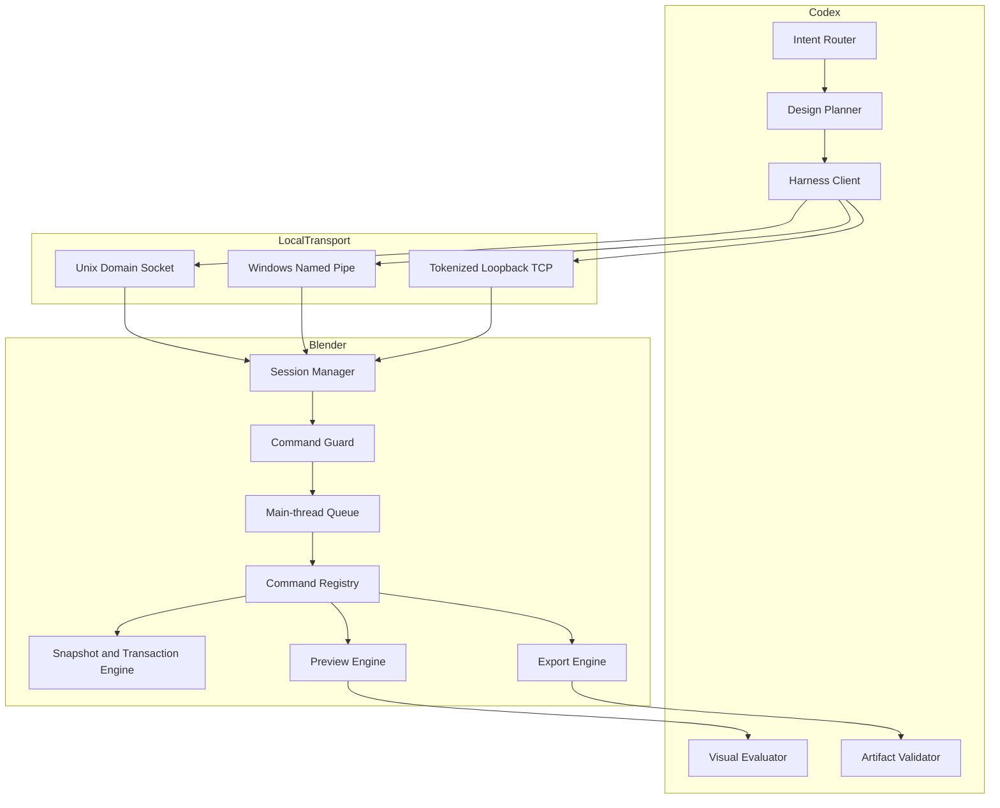

# Codex Blender 插件架构

## 状态

已交付架构。本文档描述 `codex-blender` 版本 `0.3.0` 当前的 Harness 设计，取代了面向即梦上传器的旧架构，后者归档于 `docs/archive/legacy-uploader/`。权威设计记录见
[Codex Blender Harness Design](superpowers/specs/2026-09-12-codex-blender-harness-design.md)。

## 驱动因素

Codex 已经能用语言描述场景。它做不到的是把描述可靠地变成带证据的真实 Blender 交付物。推动本架构的失效模式有三个：Agent 修改用户场景却没有回滚路径；把命令退出码当作成功证据而不是验证过的产物；以及把付费远程生成混进本地建模工具。

因此本插件按优先级优化三个性质：用户场景永不丢失；每一项声明都有产物回执支撑；本地 Blender 工作与付费下游生成之间的边界是显式的，而不是隐含的。

## 范围与非目标

`codex-blender` 负责：发现 Blender 并创建或接入会话；场景、对象、修改器、材质、相机、灯光、动画、预览、保存与导出操作；里程碑截图与评审检查点；事务快照、回滚、修订控制与审计记录；以及承载大小、`SHA-256`、参数与校验状态的结构化产物回执。

它不负责 Dreamina 登录、报价、批准、提交、轮询、付费生成或最终产物下载。这些属于 `codex-dreamina-3d` 及其配套设计插件。任何 Blender 导出都不隐含交接、上传、认证、报价或付费动作。

## 上下文与信任边界



信任边界位于本地传输层。Codex 侧的一切对 Blender 而言都是不可信输入：在被放行到任何修改操作之前，它必须经过解析、闭合命令白名单校验和路径检查。Blender 永不接受未注册的命令，也永不接受未携带所期望场景修订号的修改。

## 组件职责

| 组件 | 负责 |
|---|---|
| `session.*` 注册表 | 能力、状态、关闭、审计摘要 |
| 命令防护 | 闭合白名单、修订号校验、路径包含、授权声明 |
| 主线程队列 | 排队修改操作并在 Blender 定时器回调中执行 |
| 事务引擎 | 里程碑快照、回滚、修订计数、恢复检查点 |
| 预览引擎 | 相机、前视、侧视、顶视截图以及动画采样帧 |
| 导出引擎 | 各格式写出、原子回执与状态文件 |
| 视觉评估器 | 评判新生成的图像，而不是轻信命令成功 |
| 产物校验器 | 对每个导出做独立重导入与媒体探测 |

## 依赖方向

依赖由外向内：传输 → 协议 → 内核 → Blender。

```text
transport (UDS / Named Pipe / loopback TCP)
  -> session handshake and protocol negotiation
    -> command guard
      -> main-thread queue
        -> command registry
          -> transaction, preview, and export engines
            -> Blender Python API
```

任何引擎都不会反向触达传输层。任何 Blender 数据都不在主线程之外被修改。托管模式与 Connector 模式只在校验启动与传输发现上不同，二者共用命令注册表、防护规则、事务引擎、预览引擎与导出引擎。

## 主流程

1. Codex 把请求转换为实施简报：已提供素材、必需但缺失的素材、对象与唯一性约束、场景与环境、相机路径、动画节拍、时长、输出格式与验收检查。
2. 会话开启，协商 `codex-blender/v1`，并注册能力。
3. 里程碑以轻量快照与持久恢复检查点开始。
4. 修改型命令进入队列，在主线程执行，按 `expectedSceneRevision` 校验，提交时递增修订号。
5. 每个完成的阶段产出新的相机、前视、侧视、顶视图像以及场景摘要；动画额外产出首、中、末帧。
6. Codex 评估新生成的图像。仅命令成功不构成设计验收。
7. 完成后插件展示产物清单 —— 路径、格式、字节数、`SHA-256`、场景修订号、快照、校验证据与未消解偏差 —— 并请用户选择就地结束或显式请求交接。

## 失败与恢复

| 失败 | 行为 |
|---|---|
| 未注册命令 | 关闭式失败，不派发 |
| `expectedSceneRevision` 过期 | 在修改前拒绝 |
| 非幂等 `requestId` 重复 | 返回先前响应，不重复执行 |
| 路径逃逸批准根目录 | 规范化解析后拒绝 |
| 修改过程抛出异常 | 当前事务回滚，并报告恢复状态 |
| Blender 崩溃 | 恢复时重开最后检查点，只重放已提交的幂等命令 |
| 校验失败 | 停下等待恢复，而不是继续推进计划 |
| 暂停或接管 | 在命令之间生效，取消排队工作，作废活动事务与导出批准，并要求重新检查 |

回滚永不撤销用户手工做出的编辑。撤销会话与加载其他文件都会停止会话。

## 运行模式

**托管模式**由 Codex 启动 Blender 并加载临时引导脚本。不写入任何 Blender 偏好设置，也不安装插件。进程在设计会话期间保持存活。

**Connector 模式**是一个轻量 Blender 插件，在已打开的 Blender 进程内暴露同一套 Harness。它提供连接状态、启动与停止、活动会话身份以及可见的撤销控件。它不含任何 Dreamina 代码，也永不开启任意远程访问。

## 平台与传输

| 平台 | 状态 | 首选传输 |
|---|---|---|
| macOS Apple Silicon | 发布门禁 | Unix Domain Socket |
| Windows x64 | 发布门禁 | Named Pipe |
| Linux | 实验性 | 令牌化环回 TCP |

两个发布门禁平台都同时支持带令牌的 `127.0.0.1` TCP 作为回退。每个会话使用随机 256 位密钥、受限的套接字或管道权限、空闲过期、请求大小上限以及协议版本协商。

## 安全

- 闭合命令白名单；未知命令关闭式失败。
- 本地传输之外没有网络监听；TCP 只绑定环回地址。
- 批准的项目、素材与输出根目录在规范化路径解析后强制校验，符号链接与路径穿越都无法逃逸。
- 请求与响应有大小上限，密钥永不写日志。
- 专家 Python（`advanced.execute_python`）默认关闭，需静态扫描、限制网络与子进程、检查点化、哈希、审计，并且仅在显式动作绑定授权后执行。
- 当 Blender 切换到未批准的文件时，Connector 停止接受命令。

## 可靠性

里程碑批准绑定 `sceneRevision + snapshotId`，最终导出必须使用所绑定的修订号。长动画输出被拆分为帧生产（`RENDER_ANIMATION_FRAMES`）与视频合成（`COMPOSE_VIDEO`）两个可恢复作业；合成只消费完整且哈希校验通过的 `FrameSequenceReceipt`，显式恢复会复用已验证帧，只替换缺失或损坏的条目。模型导出会被重新导入隔离场景做结构校验，媒体输出则独立探测。

## 部署

插件以 Codex 插件形式交付，清单位于 `.codex-plugin/plugin.json`，技能位于 `skills/` 下。没有守护进程，也没有常驻服务：Blender 按需启动，Connector 插件由用户在自己选择该模式时安装到自己的 Blender 中。

## 可观测性

每个会话暴露能力、状态与审计摘要。每个完成的阶段产出可供人或 Agent 重新检查的图像，每次导出都在产物旁边写入原子回执。Connector 面板显示真实场景与会话身份、执行策略、调用方报告的阶段与进度、最后执行的命令、变更对象与错误。以百分比报告的进度永不被提升为已验证完成。

## 兼容矩阵

| 维度 | 支持范围 |
|---|---|
| Blender | 在发布门禁平台验证 5.2.1 LTS |
| 协议 | `codex-blender/v1` |
| 模型导出 | `.blend`、`.glb`、`.gltf`、`.fbx`、`.obj`、`.stl` |
| 位图导出 | `.png`、`.jpg` |
| 视频 | 经校验帧序列生成的 H.264 `.mp4` |
| 版本探测 | EXR、USD、Alembic |
| 执行策略 | `interactive`、`auto_with_budget`、`review_only` |

为向后兼容，省略策略时保持 `interactive`。

## 演进

归档的上传器时期设计不是回退路径，而是已被取代。后续增量会扩展命令注册表与导出契约，而不会把 Dreamina 行为重新引入本插件。动画创作升级、运动质量评估与后台导出工作线程是下一批声明的增量。由于命令契约是闭合且版本化的，新增能力是对注册表的增量变更，附带其 schema 与测试。

## 验收证据

运行时证据记录在 `docs/verification/` 下。Harness 运行时记录见
[harness-runtime.md](verification/harness-runtime.md)，其中记录了 macOS Apple Silicon 已验证的门禁：无需安装插件的托管前台模式、Connector 生命周期、主线程派发、里程碑预览、全部模型与位图导出、H.264 `MP4`、注入失败下的事务回滚，以及独立的模型重导入校验。

它同时记录了**尚未验收**的部分：Windows x64 托管模式与 Connector 运行时仍为 `NOT RUN`，因为它们需要 Windows Blender 主机。本文档不作该项声明。

分期 P0–P9 验收记录见
[full-plan-completion.md](verification/full-plan-completion.md)，能力目录基线见
[capability-catalog-baseline.md](verification/capability-catalog-baseline.md)。
