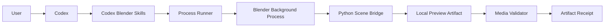
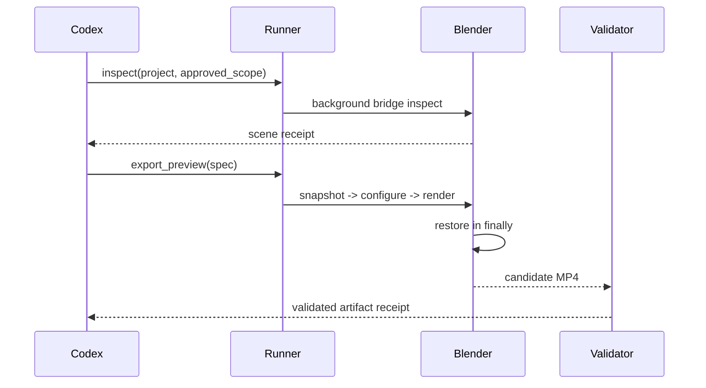

# Codex Blender Plugin Architecture

> **Status:** Historical clean-room target architecture. **Superseded:** 2026-09-12 by
> `docs/superpowers/plans/2026-09-12-codex-blender-integration.md` Revision 3. The current
> implementation vendors the complete official add-on and delegates both flows to its operators.

## 1. Drivers and scope

The plugin must make Blender automation observable, reversible, and safe for agent execution. It covers local project inspection and preview export. It excludes cloud upload, paid generation, Blender installation, and arbitrary script execution.

## 2. Context

Trust crosses from Codex into a local Blender process and again when a `.blend` file is opened. The adapter never treats project-embedded scripts as trusted by default.

## 3. Components

| Component | Owns | Does not own |
|---|---|---|
| Skills | intent routing, approvals, user-facing recovery | Blender internals |
| Capability probe | executable/version/features | installation |
| Process runner | argv, timeout, cancellation, receipt capture | shell-string evaluation |
| Scene bridge | camera/range/material inspection and temporary mutation | remote upload |
| Preview exporter | Workbench frames and MP4 assembly | paid generation |
| Media validator | codec, dimensions, fps, duration, size | creative quality judgment |
| State restorer | snapshots and deterministic restoration | persistent scene redesign |

## 4. Core flow

Cancellation or timeout terminates the child process, preserves existing outputs, removes partial temporary artifacts, and reports whether restoration was observed. It never silently retries a render.

## 5. Contracts

`SceneReceipt` includes Blender version, project fingerprint, cameras, frame range, resolution, material-preview availability, and warnings. `ArtifactReceipt` includes an absolute approved output path, SHA-256, codec, dimensions, fps, duration, bytes, source camera, and frame range.

## 6. Security and reliability

- Use argv arrays, never interpolated shell strings.
- Resolve project/output paths and reject traversal or symlink escape.
- Default to Blender auto-execution disabled.
- Record the pre-change scene configuration; restore every modified field.
- Store no credentials and emit no full private scene content.
- Use bounded timeouts and explicit cancellation receipts.

## 7. Deployment and compatibility

The Codex package contains Skills and local scripts. Blender remains a user-managed dependency. Compatibility claims require tested Blender/OS combinations; none are claimed in the current design stage.

## 8. Evolution

V1 targets Blender preview export. Later versions may add Geometry Nodes inspection or controlled editing only after new contracts and tests. Dreamina integration remains in `dreamina-3d`.
