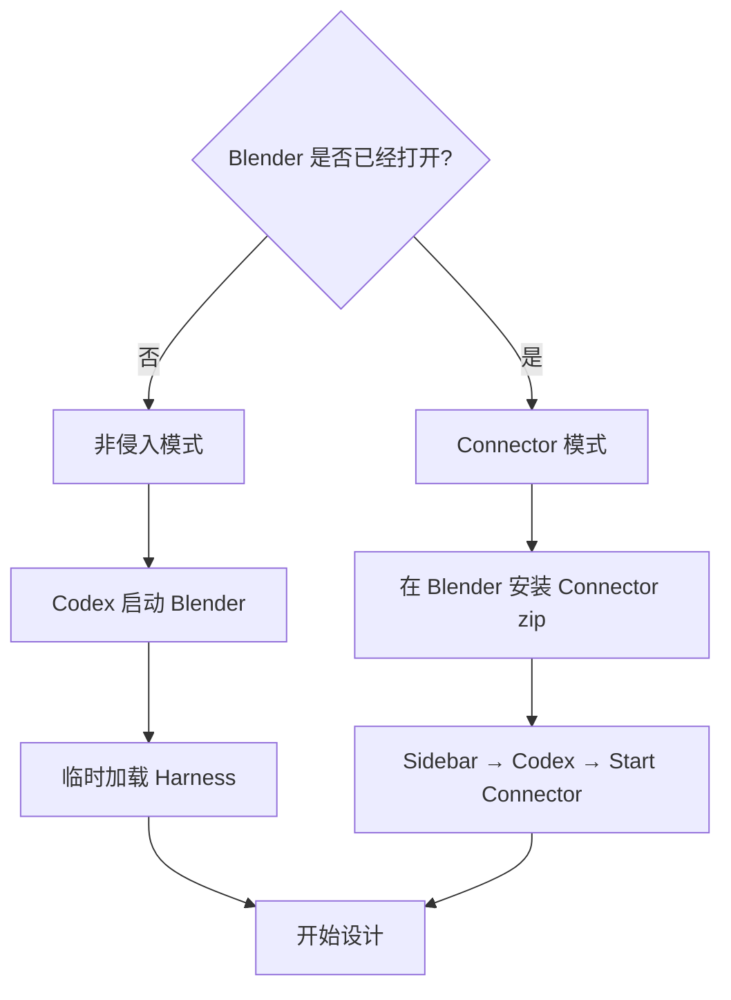

# Codex Blender 安装与使用

<p align="center"></p>

## 1. 安装 Blender

> ## [下载 Blender](https://www.blender.org/download/)

macOS Apple Silicon 选择 macOS Apple Silicon；Windows Intel/AMD 选择 Windows Installer。
安装完成后手工启动一次，看到默认立方体场景即可。

macOS 默认路径：

```text
/Applications/Blender.app/Contents/MacOS/Blender
```

## 2. 安装 Codex 插件

```bash
codex plugin marketplace add https://github.com/partme-ai/codex-blender-plugin.git --ref main
codex plugin add codex-blender@partme-ai-blender
codex plugin list --available --json
```

安装后新建一个 Codex 任务。

## 3. 选择运行模式



### 非侵入模式（推荐）

不需要在 Blender 安装 Add-on。告诉 Codex：

```text
使用非侵入模式启动 Blender，新建一个产品展示场景。先完成场景结构里程碑并给我四视图。
```

Codex 会启动 Blender、临时加载 Harness，并保持 Blender 会话运行。

### Connector 模式

适合继续编辑已经打开的场景：

1. 获取 `codex-blender-connector.zip`。
2. Blender 中打开 `Edit → Preferences → Add-ons`。
3. 选择 `Install from Disk` 并安装 zip。
4. 回到 3D View，按 `N` 打开 Sidebar。
5. 选择 `Codex`，点击 **Start Connector**。
6. 告诉 Codex连接当前 Blender。
7. 随时点击 **Revoke Access** 断开。

Connector 只负责本地控制，不包含其他云端或 AI 渲染平台逻辑。

## 4. 设计流程

```text
场景结构 → 造型 → 材质 → 灯光与相机 → 动画 → 最终预览 → 保存与导出
```

每个阶段结束后，Codex 会生成 Camera、Front、Side、Top 四张新预览。动画还会检查
首帧、中间帧和末帧。你可以确认，也可以继续提出修改。

示例：

```text
设计一个橙色磨砂金属桌面音箱，圆角长方体机身，正面黑色网罩，左上角有旋钮。
先完成造型，不要做动画。每个里程碑给我四视图，最终导出 blend、glb 和 png。
```

## 5. 安全确认

以下操作会单独请求确认：

- 删除已有对象；
- 覆盖已有文件；
- 执行高级 Python；
- 最终保存和导出；
- 关闭 Connector 或托管会话。

普通建模命令按里程碑事务执行；失败时回滚到本阶段开始前。

## 6. 支持的输出

| 类型 | 格式 |
|---|---|
| Blender 工程 | `.blend` |
| 实时模型 | `.glb`、`.gltf` |
| DCC 交换 | `.fbx`、`.obj` |
| 3D 打印 | `.stl` |
| 静态预览 | `.png`、`.jpg` |
| 动画预览 | H.264 `.mp4` |

每个文件都返回路径、大小、SHA-256、场景 revision、snapshot 和验证状态。

## 常见问题

### 必须安装 Blender Add-on 吗？

非侵入模式不需要。只有要连接已经打开的 Blender 时才安装 Connector。

### Codex 会永久修改 Blender 设置吗？

非侵入模式不会安装 Add-on，也不会修改 Preferences。Connector 只在用户点击 Start
后运行，点击 Revoke 即停止。

### 可以直接执行任意 Python 吗？

默认不可以。插件优先使用封闭命令；高级 Python 必须单独授权、生成 checkpoint 并
记录脚本哈希。

### 是否负责下游 AI 渲染？

不负责。本插件完成 Blender 设计和本地文件导出，下游渲染由对应编排插件消费回执。
