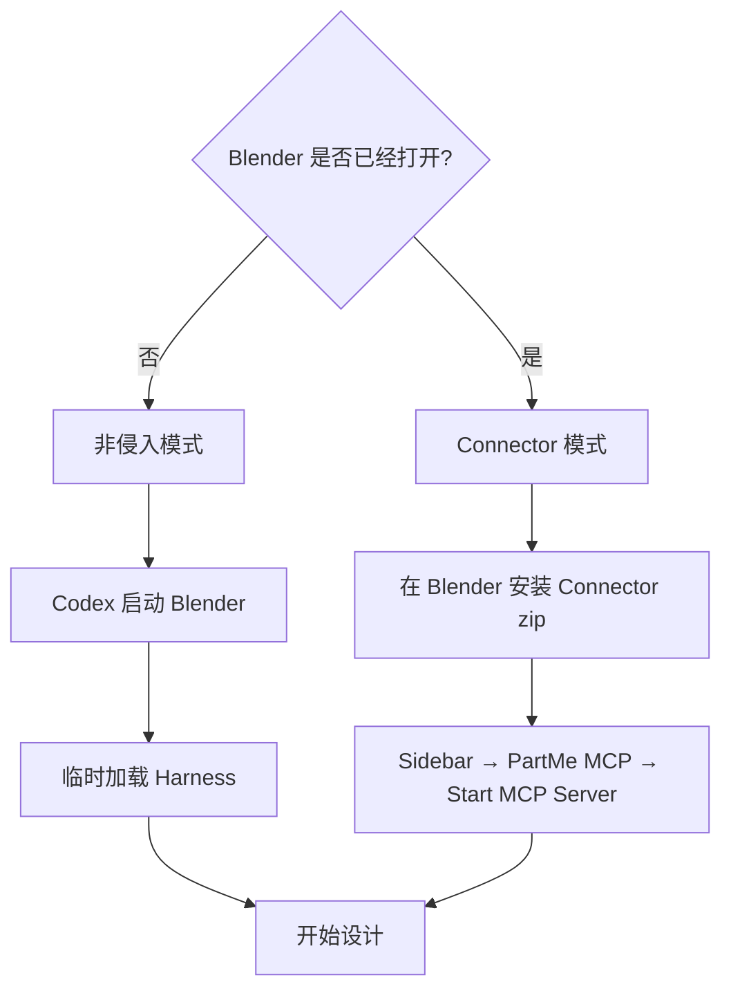

# Blender Design 安装与使用

<p align="center"></p>

## 1. 安装 Blender

> ## [下载 Blender](https://www.blender.org/download/)

macOS Apple Silicon 选择 macOS Apple Silicon；Windows Intel/AMD 选择 Windows Installer。
安装完成后手工启动一次，看到默认立方体场景即可。

macOS 默认路径：

```text
/Applications/Blender.app/Contents/MacOS/Blender
```

## 2. 安装 Codex 插件

```bash
codex plugin marketplace add https://github.com/partme-ai/partme-blender-plugin.git --ref main
codex plugin add blender-design@partme-ai-blender
codex plugin list --available --json
```

安装后新建一个 Codex 任务。

## 3. 选择运行模式



### 非侵入模式（推荐）

不需要在 Blender 安装 Add-on。告诉 Codex：

```text
使用非侵入模式启动 Blender，新建一个产品展示场景。先完成场景结构里程碑并给我四视图。
```

Codex 会启动 Blender、临时加载 Harness，并保持 Blender 会话运行。

前台视口标题会显示 Codex 当前阶段；按 `N` 打开右侧栏，选择 **Codex → Codex 制作过程**，
可以查看执行模式、当前对象、进度和错误。用 **暂停 / 接管** 暂停并自行编辑；
编辑完成后点击 **恢复 Codex**，Codex 会重新检查场景再继续。相机/正面/侧面/顶面、播放和
跳帧按钮都在这个面板中。**撤销连接** 撤销本次连接。

### Connector 模式

适合继续编辑已经打开的场景：

1. 获取 `partme-blender-mcp-addon-0.1.1.zip`。
2. Blender 中打开 `Edit → Preferences → Add-ons`。
3. 选择 `Install from Disk` 并安装 zip。
4. 回到 3D View，按 `N` 打开 Sidebar。
5. 选择 `PartMe MCP`，点击 **Start MCP Server**。
6. 告诉 Codex连接当前 Blender。
7. 随时点击 **Revoke Access** 断开。

Connector 只负责本地控制，不包含其他云端或 AI 渲染平台逻辑。

## 首次使用 MCP

> ### 还没有 Blender？[下载安装包](https://www.blender.org/download/)
>
> 打开 Blender，在 **偏好设置 > 插件** 中启用 MCP 插件，然后在 N 面板中点击
> **Start MCP Server**。

这里的可信插件名称是 **PartMe Blender MCP**。不要把另行安装的社区插件
**MCP for Blender** 当作本插件已经连接；本插件只连接带私有描述符、会话令牌、事务和恢复
能力的 Blender Design Harness。

### 1. 打开偏好设置

在 Blender 顶部选择 **Edit → Preferences**：


### 2. 安装并启用插件

选择 **Add-ons → Install from Disk**，安装发行包中的 `partme-blender-mcp-addon-0.1.1.zip`，然后
启用 **PartMe Blender MCP**。下图展示 Add-on 的启用位置；截图里的社区插件名称仅用于
说明界面位置，不代表应当启用它作为 Blender Design 连接器。


### 3. 启动安全 MCP 连接

回到 3D View，按 `N`，打开 **PartMe MCP** 页签，选择允许写入的输出目录和素材目录，然后点击
**Start MCP Server**。Codex 中的 `blender_connection_status` 返回 `connected: true` 后才算完成。

## 4. 从提示词到白模的完整流程

```text
提示词解析 → 素材就绪检查 → 场景结构 → 造型 → 材质 → 灯光与相机 → 动画 → 最终预览 → 白模交付清单 → 用户决定结束或下游交接
```

每个阶段结束后，Codex 会生成 Camera、Front、Side、Top 四张新预览。动画还会检查
首帧、中间帧和末帧。你可以确认，也可以继续提出修改。

### 自动执行（推荐）

一次性给出输出目录、交付格式和缺素材策略，即可使用 `auto_with_budget` 自动
完成白模、动画、预览和导出，不会在每一个里程碑打断你。只有删除/覆盖文件、目录越权、
高级 Python、禁止设计代理却缺少素材、验证失败或你主动接管时才会暂停。
此模式名为兼容原配置而保留；Blender 本地操作不计远程生成预算。

```text
使用 auto_with_budget：可在指定输出目录导出 blend 和 mp4；
缺少参考资产时允许 Blender 设计代理；完成后直接给我完整交付清单。
```

### 素材就绪检查

先告诉 Codex 你要做的对象、角色、场景、镜头、动作、时长和输出格式。若提示词引用了
视频、人物、武器、场景图或其他素材但没有提供，Codex 默认会**要求你补充素材**，不会把
“参考素材”悄悄臆造成另一个资产。

如果你明确说“没有素材，请你设计白模替代资产”，Codex 才会在 Blender 中原创搭建代理资产，
并在交付时标注它是“Blender 设计代理”，以及相对原始参考所作的假设。例如：

```text
我没有动作参考、角色图、武器图和场景图。请你原创设计 8 秒白模：
一名持矛主角与一名怪物交战；低姿突刺、横扫、抛矛短暂停滞、接矛续击、怪物倒地；
低机位侧向跟拍。只做 Blender 白模与可播放预览，不做 AI 渲染。
```

### 白模交付清单

完成后，Codex 必须列出而不是只说“已经完成”：

| 交付物 | 必须说明 |
|---|---|
| Blender 源工程 | `.blend` 绝对路径、场景 revision、snapshot、SHA-256 |
| 白模动画预览 | H.264 `.mp4` 绝对路径、分辨率、帧率、时长、媒体探测结果 |
| 静态验收图 | Camera、Front、Side、Top，以及动画首/中/末帧路径 |
| 设计说明 | 使用的素材、Blender 设计代理、动作与镜头时间线、已知偏差 |
| 可选模型文件 | 已请求的 `.glb`、`.gltf`、`.fbx`、`.obj` 或 `.stl` 及重导入验证状态 |

交付清单后，Codex 会询问你下一步：**结束并保留 Blender 交付**，或**明确交给
`codex-dreamina-3d-plugin` 进行下游渲染**。后者是另一个插件的工作；只有你明确选择后，
才会开始其登录、报价、上传或生成流程。

示例：

```text
设计一个橙色磨砂金属桌面音箱，圆角长方体机身，正面黑色网罩，左上角有旋钮。
先完成造型，不要做动画。每个里程碑给我四视图，最终导出 blend、glb 和 png。
```

## 5. 安全确认

以下操作会单独请求确认：

- 删除已有对象；
- 覆盖已有文件；
- 执行高级 Python；
- 交互模式的最终保存和导出（自动模式内已授权格式的新文件无需再次确认）；
- 关闭 Connector 或托管会话。

普通建模命令按里程碑事务执行；失败时回滚到本阶段开始前。
如果你已暂停接管，旧事务失效，不会回滚覆盖你的修改。只读模式在运行层拒绝建模和最终导出。

当前长时间渲染仍是同步操作，暂停在命令之间生效；独立后台导出将在后续版本完善。

## 6. 支持的输出

| 类型 | 格式 |
|---|---|
| Blender 工程 | `.blend` |
| 实时模型 | `.glb`、`.gltf` |
| DCC 交换 | `.fbx`、`.obj` |
| 3D 打印 | `.stl` |
| 静态预览 | `.png`、`.jpg` |
| 动画预览 | H.264 `.mp4` |

每个文件都返回路径、大小、SHA-256、场景 revision、snapshot 和验证状态。

## 常见问题

### 必须安装 Blender Add-on 吗？

非侵入模式不需要。只有要连接已经打开的 Blender 时才安装 Connector。

### Codex 会永久修改 Blender 设置吗？

非侵入模式不会安装 Add-on，也不会修改 Preferences。Connector 只在用户点击 Start
后运行，点击 Revoke 即停止。

### 可以直接执行任意 Python 吗？

默认不可以。插件优先使用封闭命令；高级 Python 必须单独授权、生成 checkpoint 并
记录脚本哈希。

### 是否负责下游 AI 渲染？

不负责。本插件完成 Blender 设计和本地文件导出；交付后由你选择结束，或明确将经过验证的
回执交给 `codex-dreamina-3d-plugin`。
