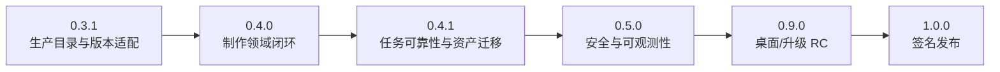

# Codex Blender 1.0 完全生产力实施计划

> **For agentic workers:** REQUIRED SUB-SKILL: Use `superpowers:subagent-driven-development`（推荐）或 `superpowers:executing-plans` 逐任务执行。每项任务严格遵循 RED → GREEN → REVIEW → COMMIT。

**Goal:** 将 `codex-blender-plugin` 从 0.3.0 提升为支持 Blender 4.2–5.2、macOS arm64 与 Windows x64 的 1.0 生产版本。

**Architecture:** 保留 `codex-blender/v1`、Managed/Connector、事务、稳定对象 ID 和快照任务。新增生产 Profile、集中版本适配层、完整制作闭环、双任务调度、资产迁移、安全加固、桌面验收和签名发布。

**Tech Stack:** Blender Python、BMesh、Cycles/Eevee、FFmpeg/ffprobe、Python 标准库、JSON Schema、GitHub Actions、SPDX、Sigstore。

**Spec:** `docs/superpowers/specs/2026-09-14-codex-blender-1.0-production-design.md`

## Global Constraints

- 正式版本固定为 4.2.23、4.3.2、4.4.3、4.5.13、5.0.1、5.1.2、5.2.1。
- 正式平台为 macOS arm64、Windows x64；Linux 只属于 experimental headless。
- 核心流程必须在 Blender + FFmpeg 离线环境工作。
- Rigify 是固定白名单扩展，不允许任意 URL、仓库或包名。
- 生产 Profile 不包含 `advanced.execute_python`。
- 单项目最长 600 秒、最大 3840×2160、最多两个 active 后台任务。
- 不上传遥测，只生成本地脱敏诊断包。
- 保持 v1 请求 Envelope 和 v1–v3 回执兼容；新增生产回执使用 v4。
- 不包含即梦生成、编剧、计费、长剧情或跨插件制片。
- 实施时新建 `feat/blender-1.0-production` worktree；不得直接在 `main` 开发。

---

## 阶段与依赖



---

# Phase A：0.3.1 生产目录与版本适配

## Task 1：固化规格和重新计算真实基线

**Files**

- Create: `docs/superpowers/specs/2026-09-14-codex-blender-1.0-production-design.md`
- Create: `docs/superpowers/plans/2026-09-14-codex-blender-1.0-production.md`
- Create: `tests/test_documented_capability_counts.py`
- Modify: `docs/verification/full-plan-completion.md`
- Modify: `docs/verification/blender-domain-coverage-matrix.md`

**Interfaces**

- Produces: `generate_coverage_summary(runtime_mode: str) -> dict`
- Managed 和 Connector 分别统计，禁止合并成单一命令总数。

**Steps**

- [ ] 写失败测试，断言 README/验收文档中的数量来自运行时生成结果。
- [ ] 运行：

```bash
python3 -m unittest tests.test_documented_capability_counts -v
```

Expected: FAIL，现有文档仍包含过期的 163/24 L1 数字。

- [ ] 从当前 `main` 重新生成：
  - Managed：命令、L1/L3/L4、Skill；
  - Connector：相同指标及官方上传器差异；
  - 当前源码/cache/remote SHA；
  - CI 与 Windows L4 对应 commit。
- [ ] 修改文档，只引用生成的 JSON，不手工维护重复数字。
- [ ] 运行目标测试与全量测试。
- [ ] 提交：

```bash
git commit -m "docs: establish Blender 1.0 production baseline"
```

---

## Task 2：实现 Production Profile

**Files**

- Create: `schemas/production_profile.schema.json`
- Create: `scripts/harness/production_profile.py`
- Create: `config/production-profile.json`
- Create: `tests/test_production_profile.py`
- Modify: `scripts/harness/registry.py`
- Modify: `scripts/harness/runtime.py`
- Modify: `scripts/harness/runtime_catalog.py`

**Interfaces**

```python
class ProductionProfile:
    @classmethod
    def load(cls, path: Path) -> "ProductionProfile": ...
    def verdict(self, command_id: str, runtime: RuntimeIdentity) -> CapabilityVerdict: ...
    def status(self, runtime: RuntimeIdentity) -> dict: ...
```

新增命令：

```text
production.status()
capability.list(profile?, blenderVersion?, platform?, runtimeMode?, domain?, maturity?, offset?, limit?)
capability.describe(id, profile?, blenderVersion?, platform?, runtimeMode?)
```

**Steps**

- [ ] 写失败测试：
  - production 命令必须有 Skill、运行、视觉、交付证据；
  - L4 必须有恢复与兼容证据；
  - expert/experimental 不进入生产目录；
  - optional 官方上传器不可阻塞核心 ready；
  -证据路径不存在时 Validator 失败。
- [ ] 运行：

```bash
python3 -m unittest tests.test_production_profile -v
```

Expected: FAIL，Profile 模块尚不存在。

- [ ] 实现 Profile、Schema 和 runtime verdict。
- [ ] 保持旧 `capability.list/describe` 无新参数时的响应兼容。
- [ ] 增加 Profile 内容哈希，写入 `production.status.catalogHash`。
- [ ] 运行全量测试和分发校验。
- [ ] 提交：

```bash
git commit -m "feat: add evidence-gated production profile"
```

---

## Task 3：建立 Blender 4.2–5.2 兼容层

**Files**

- Create: `scripts/harness/compat/base.py`
- Create: `scripts/harness/compat/selector.py`
- Create: `scripts/harness/compat/v42.py`
- Create: `scripts/harness/compat/v43_v44.py`
- Create: `scripts/harness/compat/v45.py`
- Create: `scripts/harness/compat/v50_v51.py`
- Create: `scripts/harness/compat/v52.py`
- Create: `tests/test_compatibility_adapter.py`
- Create: `tests/runtime/api_surface_snapshot.py`

**Interfaces**

```python
@dataclass(frozen=True)
class RuntimeIdentity:
    blender_version: tuple[int, int, int]
    platform: str
    architecture: str
    runtime_mode: str

def select_adapter(identity: RuntimeIdentity) -> BlenderCompatibilityAdapter: ...
```

Adapter 必须提供：

```text
create_compositor_tree
configure_file_output
create_sequence_strip
create_sequence_effect
configure_geometry_node_interface
create_grease_pencil_data
configure_hair_curves
enable_rigify
configure_render_engine
export_asset
```

**Steps**

- [ ] 为七个版本准备 API surface fixture。
- [ ] 写失败测试，确认 4.2、4.5、5.2 返回不同 adapter；范围外版本拒绝。
- [ ] 将散落的 `bpy.app.version` 和 `hasattr` 兼容判断迁移到 adapter。
- [ ] 领域命令只能调用 adapter，不自行判断 Blender 版本。
- [ ] 对未知 socket、node、operator 返回 `CAPABILITY_UNAVAILABLE`。
- [ ] 运行：

```bash
python3 -m unittest tests.test_compatibility_adapter -v
python3 -m unittest discover -s tests
```

- [ ] 提交：

```bash
git commit -m "refactor: centralize Blender version compatibility"
```

---

## Task 4：建立 macOS/Windows Blender 矩阵

**Files**

- Create: `config/blender-release-matrix.json`
- Create: `scripts/update_blender_release_matrix.py`
- Create: `.github/workflows/blender-matrix.yml`
- Create: `tests/test_blender_release_matrix.py`
- Modify: `.github/workflows/windows-l4.yml`

**Matrix**

```text
4.2.23  4.3.2  4.4.3  4.5.13  5.0.1  5.1.2  5.2.1
× macOS arm64
× Windows x64
```

Blender 包及校验值必须来自 [Blender 官方下载目录](https://download.blender.org/release/)。

**Steps**

- [ ] 写失败测试，验证版本、平台、下载 URL、SHA-256 和 artifact 名称完整。
- [ ] 实现只读 release-matrix 更新器；它读取官方 `.sha256`，不自行选择版本。
- [ ] PR 矩阵运行 4.2.23、4.5.13、5.2.1。
- [ ] weekly/release 矩阵运行全部 14 组合。
- [ ] 每个组合运行：

```bash
blender --background --factory-startup \
  --python-exit-code 1 \
  --python tests/runtime/api_surface_snapshot.py \
  -- <evidence-dir>
```

- [ ] 上传 catalog、API snapshot、测试、Blender SHA 和 Connector ZIP。
- [ ] 提交：

```bash
git commit -m "ci: add Blender 4.2 through 5.2 certification matrix"
```

---

## Task 5：关闭生产 Profile 中的 L1

**Files**

- Create: `tests/runtime/lifecycle_commands_acceptance.py`
- Modify: `scripts/harness/runtime_catalog.py`
- Modify: `tests/test_capability_catalog.py`
- Modify: `docs/verification/capability-catalog-baseline.md`

**Disposition**

- `advanced.execute_python` → `expert`，保持 L1，不计生产覆盖。
- 以下 17 条通过真实证据提升至 L3：
  - capability list/describe；
  - session status/capabilities/pause/resume/progress；
  - scene inspect；
  - object curve/text；
  - material image texture；
  - view set/focus/present；
  - playback frame/play；
  - preview capture。
- Connector 官方上传器保持 optional，不计核心 production gate。

**Acceptance**

```python
assert production_status["l1Commands"] == []
assert production_status["status"] == "ready"
```

- [ ] 运行七版本双平台 acceptance。
- [ ] 提交：

```bash
git commit -m "test: graduate core lifecycle commands to production"
```

- [ ] 发布 0.3.1，并从新缓存复验。

---

# Phase B：0.4.0 主要制作领域闭环

## Task 6：UV 重叠和 Texel Density

**Files**

- Modify: `scripts/harness/commands/uv.py`
- Modify: `scripts/harness/runtime.py`
- Create: `tests/test_uv_quality.py`
- Create: `tests/runtime/uv_production_acceptance.py`

**Interfaces**

```text
uv.detect_overlap(objectId, uvLayer?, tolerance?)
uv.measure_texel_density(objectId, uvLayer?, textureWidth, textureHeight, targetDensity?)
```

**Acceptance**

- 精确返回重叠岛、面索引、重叠面积和占比。
- 零面积 UV 单独报告。
- Texel density 误差≤5%。
- 处理 UDIM tile，不把不同 tile 误判为重叠。

**Commit**

```bash
git commit -m "feat: add production UV overlap and density validation"
```

---

## Task 7：可编辑 Retopology

**Files**

- Create: `scripts/harness/commands/retopo.py`
- Modify: `scripts/harness/runtime.py`
- Modify: `scripts/harness/registry.py`
- Create: `tests/test_retopo_commands.py`
- Create: `tests/runtime/retopo_acceptance.py`
- Create: `skills/codex-blender-retopology/SKILL.md`

**Interfaces**

```text
retopo.setup_surface(sourceObjectId, targetName, symmetry, offset)
retopo.project(objectId, sourceObjectId, method, maxDistance)
retopo.transfer_layers(sourceObjectId, targetObjectId, layers)
retopo.validate(objectId, sourceObjectId, maxDeviation, maxPoleValence)
```

**Acceptance**

- 结果始终可编辑。
- 不将 Voxel/Quadriflow 自动结果宣传为专业手工重拓扑。
- 超出偏差或 pole 阈值时进入人工接管状态。
- 保存重开后投射、拓扑和数据层保持。

**Commit**

```bash
git commit -m "feat: add editable retopology workflow"
```

---

## Task 8：角色变形和高级动画

**Files**

- Modify: `scripts/harness/commands/rig.py`
- Modify: `scripts/harness/commands/advanced_animation.py`
- Create: `tests/test_character_production.py`
- Create: `tests/runtime/character_deformation_acceptance.py`

**Interfaces**

```text
rig.auto_weights(mesh, armature, maxInfluences)
rig.validate_deformation(mesh, armature, poses, thresholds)
animation.driver_create(owner, dataPath, expression, variables)
animation.keying_set_create(name, paths)
animation.marker_set(name, frame, camera?)
animation.motion_path_calculate(target, frameStart, frameEnd)
animation.root_motion(armature, sourceBone, targetObject, frameStart, frameEnd)
```

**Acceptance**

- 权重和为 1±0.001。
- 每顶点最大影响数默认 4。
- 无未加权顶点。
- 肩、髋、肘、膝极限姿势无指定阈值外塌陷。
- 标准人形、非标准比例人形、四足角色均通过保存重开。
- 既有长矛交接阈值继续通过。

**Commit**

```bash
git commit -m "feat: complete character deformation and animation controls"
```

---

## Task 9：Hair、Simulation、Grease Pencil

**Files**

- Modify: `scripts/harness/commands/hair.py`
- Modify: `scripts/harness/commands/simulation.py`
- Modify: `scripts/harness/commands/grease_pencil.py`
- Create: `tests/runtime/surface_motion_acceptance.py`

**Interfaces**

```text
hair.groom(objectId, operation, strength, selection)
hair.validate(objectId, surfaceObjectId, limits)
simulation.bake(objectId, bakeType, frameStart, frameEnd)
simulation.validate(objectId, metrics)
grease_pencil.add_modifier(objectId, type, settings)
grease_pencil.interpolate(objectId, layer, frameStart, frameEnd, easing)
```

**Hair operations**

```text
COMB CUT LENGTH CLUMP NOISE SMOOTH
```

**Acceptance**

- 毛发无未绑定 strand、NaN、无限长度。
- 模拟参数变化使旧缓存失效。
- 取消 bake 后工程可重开。
- Grease Pencil 插值、modifier、材质和帧保存重开一致。

**Commit**

```bash
git commit -m "feat: complete hair simulation and grease pencil workflows"
```

---

## Task 10：高级 Material、Compositor 和 VSE

**Files**

- Modify: `scripts/harness/commands/material.py`
- Modify: `scripts/harness/commands/compositor.py`
- Modify: `scripts/harness/commands/sequence.py`
- Create: `tests/runtime/postproduction_acceptance.py`

**Interfaces**

```text
material.add_node(material, nodeType, name)
material.connect_nodes(material, fromNode, fromSocket, toNode, toSocket)
sequence.split(name, frame, leftName, rightName)
sequence.configure_proxy(name, sizes, directory)
sequence.add_modifier(name, modifierType, settings)
sequence.color_grade(name, lift, gamma, gain)
```

白名单至少覆盖：

- Principled、Image Texture、Normal Map、Mapping；
- Math、Mix、ColorRamp；
- Render Layers、File Output、Cryptomatte、Keying、Mask；
- VSE transform、crop、color balance、proxy。

**Acceptance**

- 不接受任意 node/operator 字符串。
- Proxy 路径必须位于授权目录。
- VSE 输出通过 H.264/AAC、精确帧率和音频检查。
- `.blend` 重开后节点、strip、proxy 和 modifier 完整。

**Commit**

```bash
git commit -m "feat: complete lookdev compositing and VSE production tools"
```

- [ ] 发布 0.4.0 并重装缓存。

---

# Phase C：0.4.1 可靠性与可移植性

## Task 11：依赖清单和工程打包

**Files**

- Create: `schemas/dependency_manifest.schema.json`
- Create: `schemas/project_package_receipt.schema.json`
- Create: `scripts/harness/dependencies.py`
- Modify: `scripts/harness/commands/asset.py`
- Create: `tests/test_project_portability.py`
- Create: `tests/runtime/project_portability_acceptance.py`

**Interfaces**

```text
asset.dependencies(includePacked?)
asset.validate_portability(targetDirectory)
asset.package_project(targetDirectory, includeCaches, includeProxies)
```

**Dependency kinds**

```text
IMAGE UDIM FONT AUDIO VIDEO IMAGE_SEQUENCE
BLEND_LIBRARY NODE_GROUP SIMULATION_CACHE EXTENSION
```

**Acceptance**

- 只写新目录，不修改活动工程。
- 不覆盖已有目录。
- 符号链接和路径逃逸失败。
- 在另一台机器、原路径不可用时重开并渲染。
- 所有文件具有 SHA-256 和许可证来源。

**Commit**

```bash
git commit -m "feat: add portable Blender project packages"
```

---

## Task 12：资源预估与双任务调度

**Files**

- Create: `schemas/resource_estimate_receipt.schema.json`
- Create: `scripts/harness/resource_estimator.py`
- Create: `scripts/harness/scheduler.py`
- Modify: `scripts/harness/jobs.py`
- Create: `tests/test_job_scheduler.py`

**Interfaces**

```text
job.estimate(kind, parameters)
job.list(state?, offset?, limit?)
job.events(jobId, afterRevision?)
```

**Policy**

- 最大 active jobs=2。
- 第三个任务 FIFO queued。
- 优先级只调整 queued 顺序。
- 不抢占 running。
- 磁盘保留 `max(卷容量20%, 20GB)`。
- 超限时不保存快照、不启动进程。
- Job log 50MiB × 5 rotations。

**Commit**

```bash
git commit -m "feat: add bounded Blender job scheduling"
```

---

## Task 13：原子 Journal 与机器重启恢复

**Files**

- Create: `scripts/harness/job_journal.py`
- Modify: `scripts/harness/jobs.py`
- Modify: `scripts/harness/job_worker.py`
- Create: `tests/test_job_journal.py`
- Create: `tests/runtime/restart_recovery_acceptance.py`

**Interfaces**

```python
class JobJournal:
    def append(self, event: JobEvent) -> int: ...
    def recover(self) -> RecoveryPlan: ...
```

**Rules**

- spec/status/manifest 使用同目录临时文件、flush、fsync、atomic replace。
- revision 单调递增。
- 事件只追加。
- 不确定的 running 任务恢复为 interrupted。
- RecoveryPlan 只允许：
  - `resume_missing_frames`
  - `recompose_verified_sequence`
  - `resubmit_from_snapshot`
  - `manual_decision_required`

**Commit**

```bash
git commit -m "feat: add crash-safe Blender job journal"
```

---

## Task 14：10 分钟 4K 压力测试

**Files**

- Create: `.github/workflows/blender-stress.yml`
- Create: `tests/runtime/ten_minute_4k_acceptance.py`
- Create: `tests/runtime/two_job_concurrency_acceptance.py`
- Create: `docs/verification/ten-minute-4k.md`

**Acceptance**

- 14,400 帧、3840×2160、24fps。
- 在 20%、50%、90% 位置分别终止 worker。
- 已验证帧哈希和修改时间不变。
- 最终视频 600±0.05 秒。
- 两个并发 4K 任务无目录、日志或状态串扰。
- 取消在 10 秒内进入终态。
- 无残留 Blender/FFmpeg 子进程。

**Commit**

```bash
git commit -m "test: certify ten-minute 4K recovery workload"
```

- [ ] 发布 0.4.1 并重装缓存。

---

# Phase D：0.5.0 安全与可观测性

## Task 15：传输、路径和子进程安全

**Files**

- Create: `scripts/harness/transport/windows_pipe.py`
- Create: `docs/security/threat-model.md`
- Modify: `scripts/harness/transport.py`
- Modify: `scripts/harness/path_policy.py`
- Modify: `scripts/harness/jobs.py`
- Create: `tests/test_security_boundaries.py`

**Requirements**

- Windows Named Pipe 使用当前用户 SID ACL。
- Pipe authkey 作为第二层认证。
- UDS 目录 0700、descriptor/socket 0600。
- token ≥256 bit，重启轮换，不写日志。
- 路径在打开文件后再次验证，防止 check/use 之间替换。
- FFmpeg 只允许本地 file、pipe、concat。
- 子进程终止整个进程组/Job Object。
- 默认 Profile 无 arbitrary Python。

**Acceptance**

- 路径替换、符号链接、重放、错误 token、跨用户 Pipe、恶意 FFmpeg 路径均被拒绝。
- 独立安全评审无 P0/P1。

**Commit**

```bash
git commit -m "security: harden Blender transports paths and workers"
```

---

## Task 16：本地支持包

**Files**

- Create: `schemas/support_bundle_receipt.schema.json`
- Create: `scripts/harness/support_bundle.py`
- Modify: `scripts/harness/runtime.py`
- Create: `tests/test_support_bundle.py`

**Interface**

```text
support.bundle(outputPath, sessionId?, jobIds?, includeScreenshots=false)
```

**Rules**

- 最大 200MiB。
- 包含版本、Profile、adapter、脱敏日志、journal、manifest、错误摘要。
- 默认排除 `.blend`、帧、视频、贴图、提示词、token 和授权 claim。
- 不联网、不上传。
- 输出 ZIP 及 SHA-256。

**Commit**

```bash
git commit -m "feat: add private local support bundles"
```

- [ ] 发布 0.5.0 并重装缓存。

---

# Phase E：0.9.0 桌面与升级 RC

## Task 17：macOS/Windows 前台认证

**Files**

- Create: `schemas/desktop_acceptance_receipt.schema.json`
- Create: `scripts/desktop_certify.py`
- Create: `tests/runtime/desktop_certification_scenario.py`
- Create: `docs/verification/desktop-certification.md`

**自动化场景**

1. 安装 Connector。
2. 启动 Blender 前台。
3. 显示 Codex 面板。
4. 建立 UDS/Named Pipe 连接。
5. 创建、选择、修改对象。
6. 切换 Camera/Front/Side/Top。
7. 播放与定位动画。
8. pause 并人工接管。
9. 人工修改对象。
10. Codex inspect 后恢复。
11. 保存、关闭、重开和重连。
12. revoke Connector。

**矩阵**

- 七个 Blender 版本 × 两个平台自动化全通过。
- 4.2.23、4.5.13、5.2.1 × 两个平台增加人工签收。
- 额外覆盖中文用户名、空格路径、高 DPI、双显示器。

**证据**

- 截图；
- 屏幕录像；
- Harness JSON；
- Blender/OS/version；
- 人工签收人、时间和结果。

**Commit**

```bash
git commit -m "test: certify Blender foreground workflows"
```

---

## Task 18：升级、回滚和缓存恢复

**Files**

- Create: `schemas/migration_receipt.schema.json`
- Create: `scripts/plugin_migration.py`
- Create: `tests/test_plugin_migration.py`
- Create: `.github/workflows/upgrade-rollback.yml`

**Scenarios**

```text
0.3.0 → 0.4.0 → 0.5.0 → 0.9.0 → 1.0.0
1.0.0 → 1.0.0 幂等重装
1.0.0 → 上一稳定版回滚
缓存文件损坏 → 干净重装
旧 Connector → 新 Harness
新 Connector → 旧 Harness
v1/v2/v3/v4 回执读取
```

**Rules**

- 升级失败不删除旧缓存。
- 握手不兼容时返回明确版本错误。
- 回滚后运行最小真实 Blender smoke。
- 不清除 Blender 工程、用户偏好或 Rigify 状态。

**Commit**

```bash
git commit -m "feat: add plugin upgrade and rollback verification"
```

- [ ] 发布 0.9.0 RC。
- [ ] 冻结公共 API。
- [ ] 只接受 P0/P1 修复和发布阻塞修复。

---

# Phase F：1.0.0 签名发布

## Task 19：最终 Production Gate

**Files**

- Create: `scripts/verify_production_release.py`
- Create: `docs/verification/1.0-production-gate.md`
- Modify: `config/production-profile.json`

**Verifier 必须同时检查**

```text
production L1 = 0
production L2 = 0
所有 production 命令 >= L3
关键保存/导出/恢复/安装/迁移 >= L4
14 个后台组合 PASS
14 个前台自动化 PASS
6 个桌面人工签收 PASS
7 个 golden projects PASS
10 分钟 4K PASS
双任务并发 PASS
安全 P0/P1 = 0
升级/回滚 PASS
fresh-cache parity PASS
```

失败任何一项都返回非零退出码。

**Commit**

```bash
git commit -m "release: close Codex Blender 1.0 production gate"
```

---

## Task 20：供应链与正式发布

**Files**

- Create: `.github/workflows/release.yml`
- Create: `scripts/generate_sbom.py`
- Modify: `.codex-plugin/plugin.json`
- Modify: `.agents/plugins/marketplace.json`

**Artifacts**

- Codex 插件包；
- Connector ZIP；
- `checksums.sha256`；
- SPDX 2.3 SBOM；
- 第三方许可证清单；
- 生产证据 manifest；
- Sigstore keyless provenance；
- immutable `v1.0.0` tag；
- GitHub Release。

**Release sequence**

- [ ] 将 manifest、Connector 和 producer version 更新为 1.0.0。
- [ ] 跑完整 Production Gate。
- [ ] 创建签名 tag `v1.0.0`。
- [ ] 构建并校验可重复 artifact。
- [ ] 生成 SBOM、checksum 和 provenance。
- [ ] 发布 GitHub Release。
- [ ] Stable Marketplace source 固定到 `v1.0.0`。
- [ ] 从空缓存安装。
- [ ] 验证：

```text
source SHA
= tag SHA
= release provenance SHA
= marketplace checkout SHA
= installed cache SHA
```

- [ ] 从最终缓存运行：
  - production.status；
  - 音箱；
  - 持矛角色；
  - 3 帧恢复与 MP4；
  - Rigify；
  - 项目打包和异机重开。

**Commit**

```bash
git commit -m "release: publish codex-blender 1.0.0"
```

---

# 1.0 Golden Projects

| 工程 | 必须覆盖 |
| --- | --- |
| 桌面音箱 | 硬表面、Boolean、UV overlap、texel density、PBR、GLB |
| 持矛角色 | Rig、权重、IK/FK、Drivers、Root Motion、道具交接 |
| 四足角色 | 非同构骨架、重定向、极限姿势 |
| 废墟庭院 | Geometry Nodes、资产实例、LOD、稳定引用 |
| 物理场景 | 布料、刚体、Hair、烟雾/流体、缓存恢复 |
| 跟踪合成 | Camera Solve、Mask、Cryptomatte、多层 EXR |
| VSE 成片 | Scene/Image Sequence/Text/Sound、Proxy、调色、H.264/AAC |

每个工程必须有：

- `.blend`；
- 多视图预览；
- 技术检查 JSON；
- 保存重开结果；
- 格式重导入；
- 资产依赖清单；
- 人工视觉结论；
- commit、Blender、平台与 adapter 信息。

# 完成定义

只有满足以下全部条件，才允许声称“完全生产就绪”：

- 核心 Production Profile 无 L1/L2。
- Blender 4.2–5.2 的七个固定版本全部验证。
- macOS arm64、Windows x64 前后台均验证。
- 10 分钟 4K 和两个并发任务通过。
- 崩溃、取消、磁盘不足、机器重启恢复通过。
- 所有工程可打包并在另一台机器重开。
- 安全审查无 P0/P1。
- 安装、升级、回滚和损坏缓存恢复通过。
- v1–v4 契约兼容。
- 七类 Golden Project 通过技术与人工视觉验收。
- Release、SBOM、checksum、签名 provenance 完整。
- GitHub、tag、Marketplace、缓存、artifact SHA 一致。
