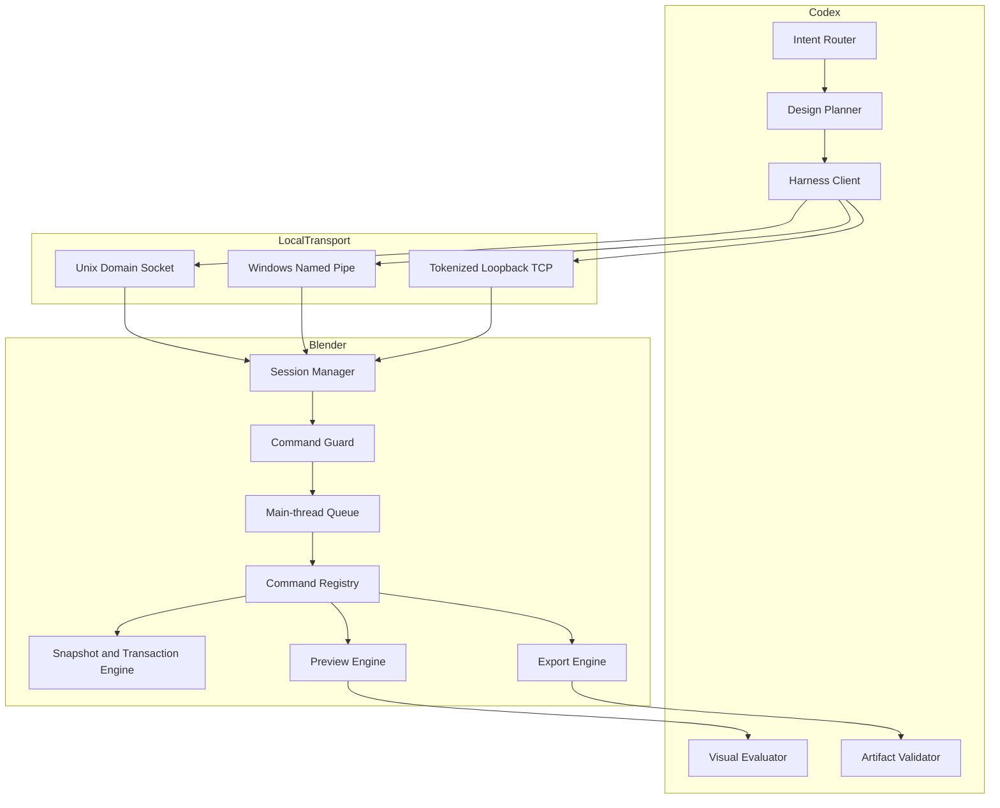

# Codex Blender Harness Design

## Status

Approved architectural direction. This specification supersedes the Jimeng-uploader-oriented
designs for `codex-blender`. The official uploader remains research material only; Dreamina
submission and AI rendering belong to `codex-dreamina-3d`.

## Goal

Let Codex turn a user's idea into a complete Blender design through controlled, observable,
reversible operations, then save and export verified artifacts.

## Product boundary

`codex-blender` owns:

- discovering Blender and creating or attaching to a Blender session;
- scene, object, material, camera, light, animation, preview, save, and export operations;
- milestone screenshots and user review checkpoints;
- transaction snapshots, rollback, revision control, and audit records;
- `.blend`, `.glb`, `.gltf`, `.fbx`, `.obj`, `.stl`, `.png`, `.jpg`, and H.264 `.mp4` outputs;
- structured artifact receipts with size, SHA-256, parameters, and validation status.

It does not own Dreamina login, quote, approval, submission, polling, paid generation, or final
Dreamina artifact download. Those remain in `codex-dreamina-3d` and its design companion.

## Input readiness and delivery decision

Before mutation, Codex converts each request into an implementation brief containing supplied
assets, required but missing assets, object and uniqueness constraints, scene/environment,
camera route, animation beats, duration, output formats, and acceptance checks. A missing
reference asset is a user decision point: Codex asks the user to provide it by default. Codex may
create a proxy only when the user explicitly asks it to design that asset; the final receipt must
identify the proxy, assumptions, and deviations so it cannot be mistaken for a supplied reference.

The Blender completion boundary is an artifact inventory, not merely a successful command. The
inventory lists each saved/exported path, format, bytes, SHA-256, scene revision, snapshot,
validation evidence, and unresolved deviations. After presenting it, Codex asks the user to
choose either to end with the local Blender delivery or explicitly request a handoff to
`codex-dreamina-3d`. No handoff, upload, authentication, quote, task submission, or paid action
is implied by a Blender export.

## Execution policy

An `ExecutionPolicy` accompanies a design request and is carried in the audit
record. It controls user-interaction cadence without weakening command or
path guardrails:

| Policy | Behaviour |
| --- | --- |
| `interactive` | Ask for milestone review and each gated action. |
| `auto_with_budget` | Default for an end-to-end request. Automatically complete approved design milestones and exports within the declared output roots, proxy-asset rule, and downstream budget. |
| `review_only` | Inspect, preview, plan, and report without scene mutation or export. |

`auto_with_budget` accepts a one-time request envelope: desired deliverables,
whether missing assets must be supplied or may become identified Blender
proxies, permitted output root, optional downstream-render intent, and a
maximum remote-generation budget. It suppresses per-milestone questions.
It must still stop for an unapproved destructive overwrite/delete, an
unapproved path, expert Python, a missing asset when proxies are forbidden,
a failed validation requiring recovery, or any external action that would
exceed the envelope. Blender keeps transaction snapshots and visual evidence
for the final report rather than asking the user to approve each one.

## Runtime modes

### Foreground visibility and executable policy (2026-09-13)

This increment implements the approved foreground-control and policy work only.
Animation-authoring upgrades, motion-quality evaluation and background export
workers remain subsequent increments. Existing official-uploader routes are preserved.

- Managed startup exposes an ephemeral Codex session panel without installing an
  Add-on or persisting preferences. Connector uses the same session panel.
- Registered `view.set`, `view.focus`, `playback.set_frame` and `playback.set`
  operations support camera/front/side/top inspection and idempotent playback.
- The panel shows actual scene/session identity, execution policy, stage and
  progress reported by the caller, last executed command, changed objects and errors.
  Progress must never be inferred as verified completion from a percentage alone.
- Pause/takeover acts between commands, cancels queued commands, invalidates active
  transactions and export approvals, and requires reinspection before further design.
  It never rolls back edits made by the user. Resume is an explicit UI action or an
  action-authorized command. Revoke and loading a different file stop the session.
- ExecutionPolicy travels from launch/Connector options through the server and runtime
  into the session. `review_only` rejects content mutation, export and authorization
  escalation even if an action claim is present; viewport/playback inspection remains available.
- Automatic mode permits fresh-file exports of the specified formats only under its
  approved root and from a revision-bound committed snapshot. Existing files, destructive
  actions, expert scripts and external uploader actions retain action authorization.
- For backwards compatibility, omitted policy remains interactive. The router selects
  automatic policy for an already-authorized end-to-end local task, without further
  milestone prompts. No remote charging logic is added to Blender.
- Main-thread dispatch yields between commands so Blender can repaint. A single
  synchronous Blender operator cannot be preempted; long export responsiveness is
  explicitly not claimed in this increment.

### Managed mode (non-invasive)

Codex launches Blender and loads a temporary bootstrap script. No Blender preference or Add-on
installation is written. The process remains alive for the design session and exits only when
the user closes it or Codex performs an authorized session shutdown.

### Connector mode

A lightweight Blender Add-on exposes the same Harness inside an already-open Blender process.
It has connection status, start/stop, active-session identity, and revoke controls. It contains
no Dreamina code and never enables arbitrary remote access.

Both modes use the same command registry, guardrails, transaction engine, preview engine, and
export engine. Only startup and transport discovery differ.

## Platforms and transport

- macOS Apple Silicon: release gate; Unix Domain Socket preferred.
- Windows x64: release gate; Named Pipe preferred.
- Both: token-authenticated `127.0.0.1` TCP fallback.
- Linux: experimental, not a release gate.
- Every session uses a random 256-bit secret, restrictive socket/pipe permissions, idle expiry,
  request-size limits, and protocol-version negotiation.

## Architecture

## Protocol

Requests use closed JSON documents with:

- `protocolVersion = codex-blender/v1`;
- `sessionId`, unique `requestId`, and `transactionId`;
- a registered `command` and closed `arguments` object;
- `expectedSceneRevision` for every mutation;
- optional authorization claim for gated operations.

Responses include request status, new scene revision, changed objects, warnings, snapshot ID,
and structured error information. Repeated `requestId` values return the prior response without
re-executing the command.

## Command domains

- `session.*`: capabilities, status, close, audit summary.
- `scene.*`: inspect, new, open, save, save-as, collection management.
- `object.*`: create primitives/curves/text, transform, duplicate, parent, rename, delete.
- `modifier.*`: add, configure, apply, remove common modifiers.
- `material.*`: create PBR materials, assign, set parameters, attach approved image textures.
- `camera.*`: create, transform, lens, clipping, active camera, look-at composition.
- `light.*`: create, energy, color, size, world background.
- `animation.*`: frame range, keyframes, interpolation, playback sampling.
- `preview.*`: camera/front/side/top screenshots and animation sample frames.
- `export.*`: save `.blend`, export supported model formats, image, and video previews.
- `job.*`: snapshot-isolated still, export, simulation bake, durable animation-frame and video-compose tasks with explicit resume.
- `sequence.*`: editable Scene, image-sequence, movie, image, text and sound strips, visual transitions, sound fades, speed and compositor modifiers.
- `compositor.*`: named scene/strip node graphs, render passes, authorized File Output and multilayer EXR configuration.
- `transaction.*`: begin, commit milestone, rollback, list snapshots.
- `advanced.execute_python`: separately authorized expert mode only.

## Main-thread rule

Transport threads may parse and validate requests but must never mutate Blender data. Mutating
commands are queued and executed by a Blender timer callback on the main thread. Responses are
published only after execution and postconditions complete.

## Transactions and recovery

1. A milestone begins with a lightweight state snapshot and a persistent recovery checkpoint.
2. Every mutation checks `expectedSceneRevision`.
3. Successful mutation increments the revision and records changed datablocks.
4. Failure rolls back the current transaction and reports whether restoration was confirmed.
5. Destructive operations, file overwrite, final export, and expert Python require an explicit
   action-bound authorization claim.
6. Milestone approval binds `sceneRevision + snapshotId`; final export must use that revision.
7. Crash recovery reopens the last checkpoint and replays only committed idempotent commands.

## Visual milestones

Stages are Scene Structure, Modeling, Materials, Lighting and Camera, Animation, Final Preview,
and Save/Export. Each completed stage emits camera/front/side/top images plus a scene summary.
Animation also emits first/middle/last frame images. Codex must evaluate fresh images; command
success alone is not design acceptance. User approval creates the next persistent checkpoint.

## Export contract

Release formats are `.blend`, `.glb`, `.gltf`, `.fbx`, `.obj`, `.stl`, `.png`, `.jpg`, H.264
`.mp4`, version-probed EXR/USD/Alembic, and persistent PNG or multilayer EXR frame sequences.
Long animation output uses `RENDER_ANIMATION_FRAMES`; `COMPOSE_VIDEO` consumes only a complete,
hash-verified FrameSequenceReceipt. Explicit resume reuses verified frames and replaces only missing
or corrupt entries. Direct synchronous MP4 remains a compatibility preview path.

Every artifact receipt contains producer, session/revision/snapshot, absolute path, format,
bytes, SHA-256, export parameters, validation status, warnings, and restoration status. Model
exports are re-imported into an isolated scene for structural validation. Media outputs are
probed independently.

## Security

- Closed command allowlist by default; unknown commands fail closed.
- No network listener outside local transports; TCP binds only to loopback.
- Approved project, asset, and output roots are enforced after canonical path resolution.
- Symlinks and path traversal cannot escape approved roots.
- Requests and responses are size bounded and secrets are never logged.
- Expert Python is disabled by default, statically scanned, network/subprocess restricted,
  checkpointed, hashed, audited, and run only after explicit authorization.
- Connector exposes a visible revoke control and stops accepting commands when Blender changes
  to an unapproved file.

## Acceptance

- The same conformance suite passes against managed and connector modes.
- Real Blender runtime tests pass on macOS Apple Silicon and Windows x64.
- A user can create a scene from an idea, inspect it, complete all visual milestones, save a
  `.blend`, export each release format, and validate every receipt.
- Transaction rollback and crash recovery are proven with injected failures.
- No Jimeng/Dreamina link, credential, quote, submission, or paid-generation behavior remains.
- `codex-dreamina-3d` can consume the validated preview artifact without importing this plugin.
- A missing required reference causes a request for user material unless the user explicitly asks
  for a Blender-designed proxy; that proxy is identified in the final artifact inventory.
- Every completed design ends by presenting the verified artifact inventory and requesting the
  user's explicit choice to finish locally or hand off downstream.
