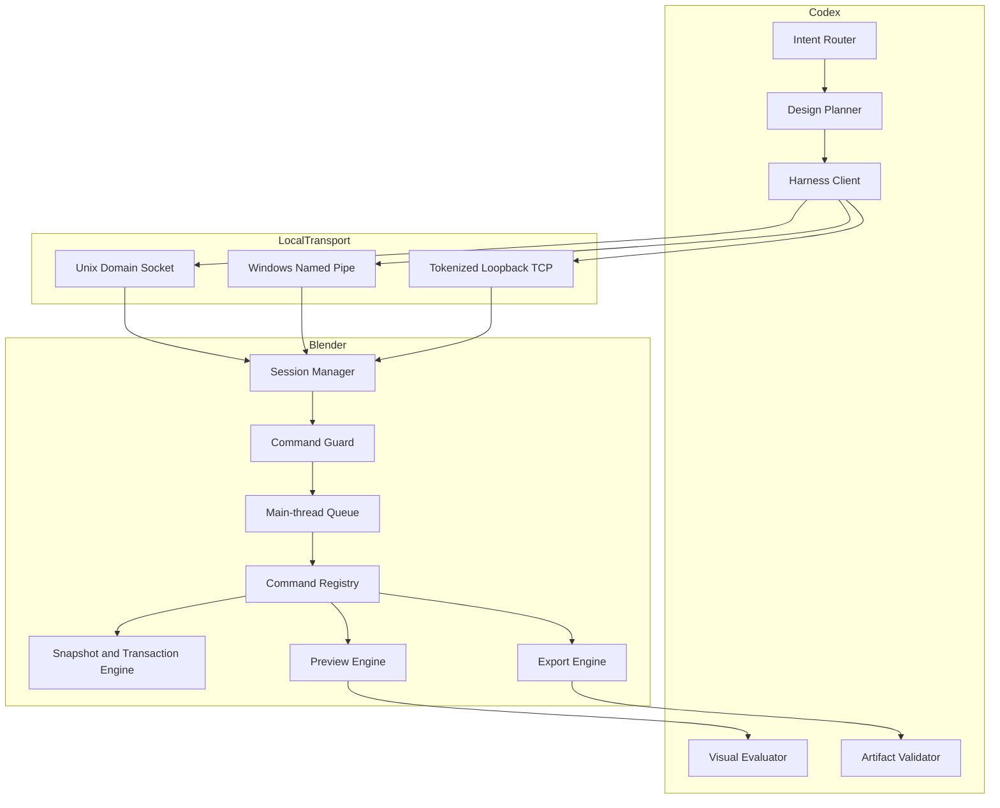

# Codex Blender Harness Design

## Status

Approved architectural direction. This specification supersedes the Jimeng-uploader-oriented
designs for `codex-blender`. The official uploader remains research material only; Dreamina
submission and AI rendering belong to `codex-dreamina-3d`.

## Goal

Let Codex turn a user's idea into a complete Blender design through controlled, observable,
reversible operations, then save and export verified artifacts.

## Product boundary

`codex-blender` owns:

- discovering Blender and creating or attaching to a Blender session;
- scene, object, material, camera, light, animation, preview, save, and export operations;
- milestone screenshots and user review checkpoints;
- transaction snapshots, rollback, revision control, and audit records;
- `.blend`, `.glb`, `.gltf`, `.fbx`, `.obj`, `.stl`, `.png`, `.jpg`, and H.264 `.mp4` outputs;
- structured artifact receipts with size, SHA-256, parameters, and validation status.

It does not own Dreamina login, quote, approval, submission, polling, paid generation, or final
Dreamina artifact download. Those remain in `codex-dreamina-3d` and its design companion.

## Runtime modes

### Managed mode (non-invasive)

Codex launches Blender and loads a temporary bootstrap script. No Blender preference or Add-on
installation is written. The process remains alive for the design session and exits only when
the user closes it or Codex performs an authorized session shutdown.

### Connector mode

A lightweight Blender Add-on exposes the same Harness inside an already-open Blender process.
It has connection status, start/stop, active-session identity, and revoke controls. It contains
no Dreamina code and never enables arbitrary remote access.

Both modes use the same command registry, guardrails, transaction engine, preview engine, and
export engine. Only startup and transport discovery differ.

## Platforms and transport

- macOS Apple Silicon: release gate; Unix Domain Socket preferred.
- Windows x64: release gate; Named Pipe preferred.
- Both: token-authenticated `127.0.0.1` TCP fallback.
- Linux: experimental, not a release gate.
- Every session uses a random 256-bit secret, restrictive socket/pipe permissions, idle expiry,
  request-size limits, and protocol-version negotiation.

## Architecture

## Protocol

Requests use closed JSON documents with:

- `protocolVersion = codex-blender/v1`;
- `sessionId`, unique `requestId`, and `transactionId`;
- a registered `command` and closed `arguments` object;
- `expectedSceneRevision` for every mutation;
- optional authorization claim for gated operations.

Responses include request status, new scene revision, changed objects, warnings, snapshot ID,
and structured error information. Repeated `requestId` values return the prior response without
re-executing the command.

## Command domains

- `session.*`: capabilities, status, close, audit summary.
- `scene.*`: inspect, new, open, save, save-as, collection management.
- `object.*`: create primitives/curves/text, transform, duplicate, parent, rename, delete.
- `modifier.*`: add, configure, apply, remove common modifiers.
- `material.*`: create PBR materials, assign, set parameters, attach approved image textures.
- `camera.*`: create, transform, lens, clipping, active camera, look-at composition.
- `light.*`: create, energy, color, size, world background.
- `animation.*`: frame range, keyframes, interpolation, playback sampling.
- `preview.*`: camera/front/side/top screenshots and animation sample frames.
- `export.*`: save `.blend`, export supported model formats, image, and video previews.
- `transaction.*`: begin, commit milestone, rollback, list snapshots.
- `advanced.execute_python`: separately authorized expert mode only.

## Main-thread rule

Transport threads may parse and validate requests but must never mutate Blender data. Mutating
commands are queued and executed by a Blender timer callback on the main thread. Responses are
published only after execution and postconditions complete.

## Transactions and recovery

1. A milestone begins with a lightweight state snapshot and a persistent recovery checkpoint.
2. Every mutation checks `expectedSceneRevision`.
3. Successful mutation increments the revision and records changed datablocks.
4. Failure rolls back the current transaction and reports whether restoration was confirmed.
5. Destructive operations, file overwrite, final export, and expert Python require an explicit
   action-bound authorization claim.
6. Milestone approval binds `sceneRevision + snapshotId`; final export must use that revision.
7. Crash recovery reopens the last checkpoint and replays only committed idempotent commands.

## Visual milestones

Stages are Scene Structure, Modeling, Materials, Lighting and Camera, Animation, Final Preview,
and Save/Export. Each completed stage emits camera/front/side/top images plus a scene summary.
Animation also emits first/middle/last frame images. Codex must evaluate fresh images; command
success alone is not design acceptance. User approval creates the next persistent checkpoint.

## Export contract

Release formats are `.blend`, `.glb`, `.gltf`, `.fbx`, `.obj`, `.stl`, `.png`, `.jpg`, and
H.264 `.mp4`. USD/USDZ, Alembic, EXR, multilayer renders, sculpting, complex Geometry Nodes,
fluid/cloth simulation, and automatic rig generation are later phases.

Every artifact receipt contains producer, session/revision/snapshot, absolute path, format,
bytes, SHA-256, export parameters, validation status, warnings, and restoration status. Model
exports are re-imported into an isolated scene for structural validation. Media outputs are
probed independently.

## Security

- Closed command allowlist by default; unknown commands fail closed.
- No network listener outside local transports; TCP binds only to loopback.
- Approved project, asset, and output roots are enforced after canonical path resolution.
- Symlinks and path traversal cannot escape approved roots.
- Requests and responses are size bounded and secrets are never logged.
- Expert Python is disabled by default, statically scanned, network/subprocess restricted,
  checkpointed, hashed, audited, and run only after explicit authorization.
- Connector exposes a visible revoke control and stops accepting commands when Blender changes
  to an unapproved file.

## Acceptance

- The same conformance suite passes against managed and connector modes.
- Real Blender runtime tests pass on macOS Apple Silicon and Windows x64.
- A user can create a scene from an idea, inspect it, complete all visual milestones, save a
  `.blend`, export each release format, and validate every receipt.
- Transaction rollback and crash recovery are proven with injected failures.
- No Jimeng/Dreamina link, credential, quote, submission, or paid-generation behavior remains.
- `codex-dreamina-3d` can consume the validated preview artifact without importing this plugin.

