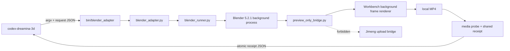

# Dreamina 3D Preview Adapter Design

## Goal

Expose `codex-blender` as a callable preview producer for `codex-dreamina-3d`
without starting the Jimeng upload bridge or performing any paid/network
generation action.

## Scope

- Add the executable `bin/blender_adapter` contract discovered by
  `codex-dreamina-3d`.
- Accept `--request`, `--receipt`, `--output`, `--inspect`, and `--status`.
- Launch the user-installed Blender through the existing safe runner.
- Render one camera preview through the vendored preview renderer only.
- Validate and atomically write a shared `ArtifactReceipt` version `1.0.0`.
- Support query-only timeout reconciliation without repeating a render.

Maya and paid Seedance generation are out of scope.

## Architecture



The existing `camera_render` and `local_upload` flows remain unchanged. Blender
5.2.1 rejects the vendored renderer's `bpy.ops.render.opengl` call in
`--background` mode because no OpenGL context exists. The new bridge therefore
uses `BLENDER_WORKBENCH` with `bpy.ops.render.render(write_still=True)` for each
frame and reuses the vendored ffmpeg sequence encoder. It never calls
`start_local_bridge`, `render_upload`, `upload_existing`, Dreamina CLI, or any
network API.

## Public Adapter Contract

Normal export:

```text
bin/blender_adapter --request REQUEST --receipt RECEIPT --output OUTPUT
```

Inspection:

```text
bin/blender_adapter --request REQUEST --receipt RECEIPT --output OUTPUT --inspect
```

Status reconciliation:

```text
bin/blender_adapter --status --request REQUEST --receipt RECEIPT
```

The export request consumes the snake_case fields emitted by
`codex-dreamina-3d`: `scene`, `camera_name`, `frame_range`, `artifact_id`, and
`output_label`. Optional `blender_executable` is accepted only as an explicit
absolute path; otherwise the adapter checks the standard macOS Blender app
binary and then `PATH`.

The receipt uses the shared contract fields: `schema_version`,
`producer_plugin`, `producer_version`, `artifact_id`, `path`, `sha256`,
`codec`, `container`, `dimensions`, `fps`, `duration_seconds`, `bytes`,
`camera`, `frame_range`, `preview_mode`, and `restoration`.

## Safety and Failure Semantics

- No shell command strings and no implicit installation.
- The scene and output paths are resolved and scope-checked before launch.
- Embedded `.blend` scripts remain disabled.
- One adapter invocation performs at most one render attempt.
- A timeout never triggers another render; `--status` only reads the durable
  status/receipt files.
- The receipt is published only after the MP4 probe and SHA-256 succeed.
- Restoration must be `confirmed`; otherwise the operation fails closed.
- Temporary/status writes use write, fsync, and atomic replace.

## Acceptance

- Contract tests prove inspect/export/status/error behavior and prove no upload
  bridge call occurs.
- Existing `codex-blender` tests remain green.
- `codex-dreamina-3d` discovers the adapter and its Blender fixture pipeline
  passes against the real executable contract.
- A real Blender 5.2.1 LTS smoke test produces a validated local MP4 receipt
  without contacting Dreamina or Jimeng.
