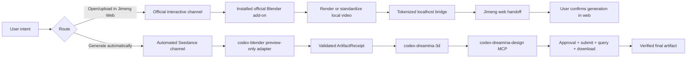
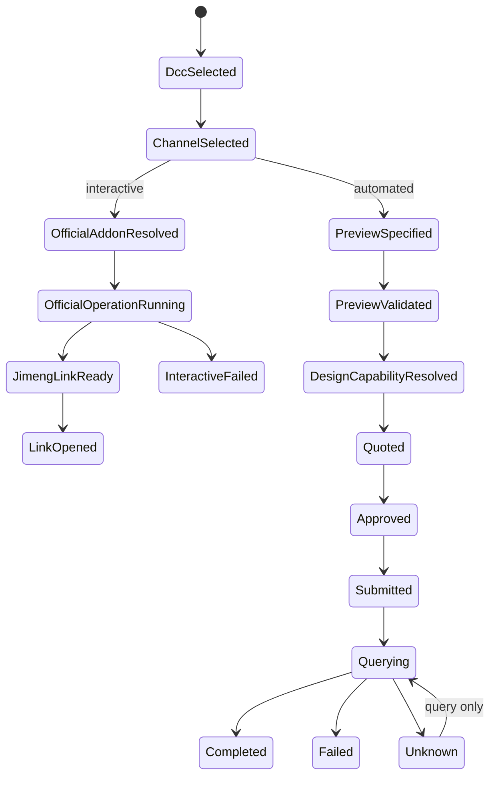

# Official Uploader Dual-Channel Integration Design

## Goal

Turn the verified Blender-to-Seedance prototype into a production-oriented
dual-channel integration while preserving the official Jimeng uploader's real
purpose and removing unlicensed upstream Python source from this plugin's
distributed payload.

## Product Model

The official Jimeng Blender uploader is an interactive handoff product. It
renders or standardizes a local preview, starts a tokenized loopback HTTP
bridge, creates a Jimeng URL carrying the bridge endpoint, and lets the Jimeng
web application fetch the video and prompt. It does not submit or monitor a
Seedance generation task itself.

The production design therefore exposes two distinct channels:

`Jimeng link ready` and `Seedance generation completed` are different terminal
states and must never be reported as equivalent.

## Repository Ownership

| Repository | Responsibility |
|---|---|
| `codex-blender-plugin` | Blender discovery, official add-on discovery, interactive operator invocation, preview-only rendering, local artifact receipt |
| `codex-dreamina-3d-plugin` | channel routing, end-to-end job state, receipt validation, safe handoff between Blender and Design |
| `codex-dreamina-design-plugin` | trusted Dreamina CLI/MCP capability discovery, native approval, submit-at-most-once, query, download and final artifact validation |

No repository imports another repository's implementation modules. Integration
uses executable, receipt, or MCP contracts only.

## Channel 1: Official Interactive Handoff

### Runtime Discovery

`codex-blender` discovers a user-installed official add-on without installing,
copying, or modifying it. Discovery checks:

- Blender's enabled add-on/module registry;
- the module identity `jimeng_blender_uploader`;
- the add-on version and supported Blender version;
- the required operators `jimeng.render_upload` and
  `jimeng.upload_existing`;
- the expected result properties on `bpy.types.Scene`.

Missing or incompatible installations stop with official installation
guidance. They never fall back to bundled upstream source.

### Connector Contract

The connector runs in the foreground Blender process because the official
camera path uses `bpy.ops.render.opengl` and requires a valid UI/OpenGL context.
It supports:

- `inspect_official_uploader` — read-only capability/version/status probe;
- `render_and_link` — call `bpy.ops.jimeng.render_upload()` once;
- `link_existing_video` — call `bpy.ops.jimeng.upload_existing()` once;
- `get_link_status` — read current task/link state without repeating work;
- `open_link` — call the official open-link operator only after explicit user
  intent.

The connector sets the same scene inputs as the official panel and projects
the official state and error taxonomy. It does not reproduce the private
bridge protocol.

### Completion State

Interactive completion is `JimengLinkReady`. It proves that the official
add-on produced a current link and local bridge. It does not prove account
authentication, web upload completion, Seedance acceptance, credit charge, or
final media generation.

## Channel 2: Automated Seedance Generation

The automated path remains headless and never depends on the official add-on.

1. `bin/blender_adapter` renders a Workbench preview with standard background
   rendering.
2. The adapter validates H.264/MP4 metadata, file stability and SHA-256.
3. `codex-dreamina-3d` accepts the immutable receipt and stores the local
   artifact path only in the non-secret job workspace.
4. `codex-dreamina-design` is called through its public MCP surface, using the
   enrolled trusted CLI and native action-time approval.
5. The server persists the submission intent before the paid call and the
   returned submit ID before reporting acceptance.
6. Query-only recovery continues until `success`, `fail`, or `unknown`.
7. Downloaded media is independently probed and hashed before `Completed`.

The six-mode fake executable used by existing Dreamina 3D tests remains a test
adapter. Production orchestration uses the published Dreamina Design MCP tools
rather than inventing a second paid executable protocol.

## Router

The router uses explicit intent and never silently switches channels:

| User intent | Channel |
|---|---|
| Upload/open in Jimeng, use official plugin, generate a Jimeng link | Official interactive |
| Automatically generate, run Seedance, finish in background | Automated Seedance |
| Render/export a local preview only | Preview-only Blender adapter |
| Ambiguous request | Explain both channels and require a choice |

If a `design_submit_id` exists, the router can only query or download. If an
official link is current, the router can open or report it but cannot infer a
Seedance task.

## Vendored Source Removal

The current repository contains a byte-identical copy of the upstream official
add-on whose Python license is not granted by the package. Production
distribution must remove `vendor/jimeng_blender_uploader/` and all tests or
runtime imports that require those files.

Removal is behavior-preserving by channel:

- official interactive behavior moves to runtime delegation against the
  user's installed official add-on;
- preview-only behavior uses plugin-owned Workbench rendering, media probing,
  configuration defaults and ffmpeg argv construction;
- upstream hashes and observed behavior remain in documentation as provenance
  evidence, not executable distribution content.

No upstream UI strings, identifiers beyond the public module/operator names,
private protocol implementation, helper JavaScript, or binary ffmpeg payload
is copied into replacement code.

## Security and Guardrails

- Never install or enable the official add-on silently.
- Never execute untrusted `.blend` scripts.
- Official operators run at most once per explicit request.
- Opening a browser is a separate explicit action.
- Loopback URLs and tokens remain owned by the official add-on and are redacted
  from durable logs.
- Automated paid submission requires Dreamina Design native approval and a
  bound request fingerprint.
- Unknown submit state permits queries only.
- Scene paths, video paths and output roots reject symlink escapes.
- Prompt, account identity, cookies, tokens and local bridge secrets are never
  written to the cross-plugin job ledger.

## State Model

## Compatibility

- Initial verified platform: macOS, Blender 5.2.1 LTS, official add-on 1.0.0
  CN/mac build.
- Other Blender, region and platform combinations are unsupported until
  separately observed.
- The preview receipt contract remains `1.0.0`.
- Existing `bin/blender_adapter` callers remain compatible.
- Existing Dreamina Design MCP approval and trusted-CLI enrollment remain the
  production paid-action boundary.

## Acceptance Gates

### Offline

- no upstream executable source remains in the distributed tree;
- official add-on discovery covers missing, compatible and incompatible cases;
- connector tests prove exact operator selection and at-most-once behavior;
- router scenarios distinguish link-ready from generation-complete;
- preview-only tests no longer import vendored modules;
- three repository suites and distribution validators pass;
- secret, symlink, binary-size and license scans pass.

### Runtime

- Blender 5.2.1 discovers the installed official add-on or records an explicit
  missing-add-on blocker;
- one authorized official camera-render link flow reaches
  `JimengLinkReady` without claiming Seedance completion;
- one authorized official existing-video link flow reaches
  `JimengLinkReady` without reopening or rerendering;
- preview-only Blender receipt path still passes;
- Dreamina Design MCP capability, approval-deny and approval-allow paths pass;
- one already-authorized Seedance 2.5 canary is queried/downloaded by submit ID
  without a second paid submission;
- remote CI, GitHub SHA equality and fresh Marketplace installation are
  separately verified.

## Release Boundary

The production claim is limited to the verified macOS/Blender/region matrix.
Maya remains excluded. Marketplace release is blocked until the vendored
upstream source is removed, all gates above pass, versions are incremented, and
fresh installed caches match the published GitHub revisions.
