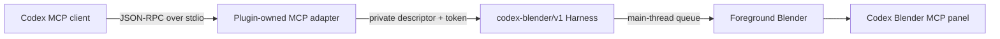

# Codex Blender Native MCP Adapter Design

## Goal

Expose every registered `codex-blender/v1` Harness command as a discoverable MCP tool without
weakening the existing session token, revision, transaction, authorization, path, recovery, or
foreground-takeover boundaries. Add a first-use path that remains useful before Blender is installed
or connected.

## Architecture

The adapter is a protocol translator, not a second Blender command implementation. Tool schemas are
generated from `RuntimeCommandRegistry`; tool calls are forwarded through the existing private
descriptor. The descriptor token is never returned to the MCP client.

## Public MCP surface

- `blender_getting_started`: always available; reports Blender discovery, the official download URL,
  Connector installation steps, panel instructions, and bundled screenshot paths.
- `blender_connection_status`: reports whether exactly one live private Harness descriptor is usable.
- `blender_transaction_begin`, `blender_transaction_commit`, `blender_transaction_rollback`, and
  `blender_authorize`: preserve Harness lifecycle operations which are intercepted before registry
  dispatch.
- One deterministic tool per registered command: `blender__<domain>__<operation>`. Its input schema is
  the registered closed argument schema plus `_transactionId`, `_requestId`,
  `_expectedSceneRevision`, and `_authorization` envelope fields where applicable.

## First-use contract

When no live Harness exists, tools fail with a structured `BLENDER_NOT_CONNECTED` result and the same
setup guidance returned by `blender_getting_started`. The user-facing copy includes:

> 还没有 Blender？下载安装包
>
> 打开 Blender，在 偏好设置 > 插件 中启用 MCP 插件，然后在 N 面板中点击 Start MCP Server。

The detailed guide names the plugin-owned Add-on (`Codex Blender Connector`) so the community
`MCP for Blender` Add-on is not mistaken for the trusted Harness endpoint.

## Security boundaries

- Only private, non-symlink descriptors owned by the current runtime directory are accepted.
- Multiple live descriptors are an explicit ambiguity, never an implicit newest-session choice.
- The adapter does not expose arbitrary Python beyond the existing gated
  `advanced.execute_python` command.
- Gated operations retain action- and request-bound Harness authorization.
- MCP annotations are hints only; Harness enforcement remains authoritative.
- No third-party MCP Add-on source, telemetry, API key, or asset-provider integration is bundled.

## Acceptance

1. Plugin manifest points at an installed-relative stdio `.mcp.json`.
2. MCP initialize, notification, tools/list pagination, tools/call, ping, and error containment pass.
3. Every command in the managed registry has exactly one MCP tool with the same input contract.
4. Read-only live smoke reaches Blender through the Harness and never exposes its token.
5. The Connector panel says `Start MCP Server`; revoke, takeover, transactions, and exports continue
   to use the existing Harness.
6. Chinese and English onboarding documents use the official Blender download URL and package the
   supplied screenshots.
